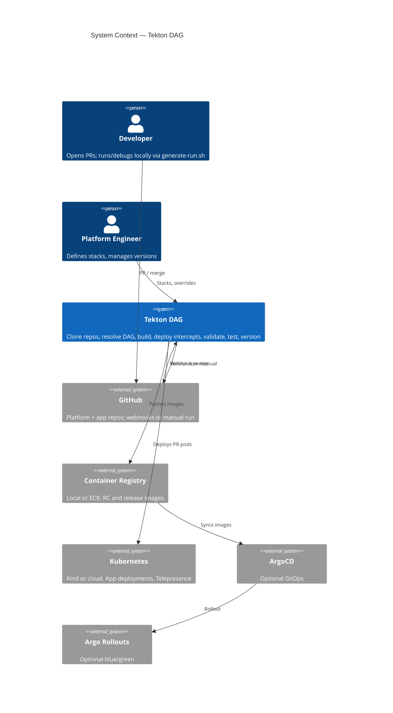
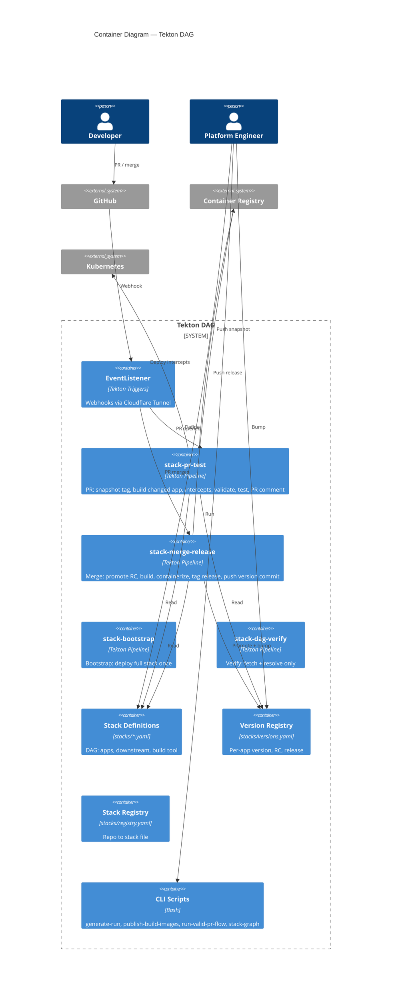

# tekton-dag

Standalone Tekton pipeline system for **local development and proof-of-concept**.

## What's new (2026-02-28)

### Webhook-driven PR → Merge flow is working end-to-end

The full automated cycle now works via **GitHub webhooks through a Cloudflare Tunnel**:

1. **Open a PR** in any app repo → webhook fires → `stack-pr-test` pipeline runs automatically
2. **PR pipeline tests only** — builds the changed app with a snapshot tag, deploys intercepts, validates propagation, runs tests, posts a PR comment. **No version bump** during PR — that's the merge pipeline's job.
3. **Merge the PR** → webhook fires → `stack-merge-release` pipeline runs automatically
4. **Merge pipeline** promotes RC → release semver, builds, containerizes, tags release images, pushes the next dev cycle version commit back to the repo.

### Pre-built compile images

Dedicated build images (one per tool) eliminate in-pod tool installation:

| Image | Base | Contents |
|-------|------|----------|
| `tekton-dag-build-node` | `node:22-slim` | Node 22 + npm + jq |
| `tekton-dag-build-maven` | `maven:3.9-eclipse-temurin-21` | JDK 21 + Maven + jq |
| `tekton-dag-build-gradle` | `eclipse-temurin:21-jdk` | JDK 21 + jq (apps use `./gradlew`) |
| `tekton-dag-build-python` | `python:3.12-slim` | Python 3.12 + pip + jq |
| `tekton-dag-build-php` | `php:8.3-cli` | PHP 8.3 + Composer + zip ext + jq |

Publish with one command (defaults to Kind registry on port 5001):

```bash
./scripts/publish-build-images.sh
```

### Registry setup for Kind

Two registries in the test environment:

| Container | Host port | In-cluster address | Purpose |
|-----------|-----------|-------------------|---------|
| `kind-registry` | `localhost:5001` | `localhost:5000` (via containerd certs.d) | Kind cluster registry — push images here, pods pull via `localhost:5000` |
| `registry` | `localhost:5000` | N/A | Standalone registry (not used by Kind) |

**Key detail:** Kind's containerd has `certs.d/localhost:5000/hosts.toml` that redirects pulls to `kind-registry:5000` on the Docker network. Pod image refs must use `localhost:5000` — using `kind-registry:5000` directly causes `ImagePullBackOff` because there's no containerd config for that hostname.

### Cloudflare Tunnel for webhooks

GitHub webhooks reach the in-cluster EventListener via:

```
GitHub → https://tekton-el.menkelabs.com → Cloudflare Tunnel → localhost:8080 → EventListener pod
```

Setup: see [docs/CLOUDFLARE-TUNNEL-EVENTLISTENER.md](docs/CLOUDFLARE-TUNNEL-EVENTLISTENER.md). The tunnel route is configured in the Cloudflare Zero Trust dashboard (Networks → Tunnels → Add route → Published application).

To start the tunnel and port-forward:

```bash
cloudflared tunnel run menkelabs-sso-tunnel-config &
kubectl port-forward svc/el-stack-event-listener 8080:8080 -n tekton-pipelines &
```

### Planned: Milestone 4

Two areas of work planned next. See [milestones/milestone-4.md](milestones/milestone-4.md) for full details.

**1. Production-safe baggage middleware libraries** — one standalone library per framework (Spring Boot, Spring Legacy, Node, Flask, PHP) that handles `x-dev-session` / W3C Baggage propagation. Each library supports all three propagation roles (originator, forwarder, terminal) via configuration, so any app on any framework can sit at any position in any DAG. Two guard layers (build-time exclusion + runtime env-var gate) ensure zero chance of execution in production. Test stacks will exercise every framework in every role.

| Library | Package | Framework |
|---------|---------|-----------|
| `baggage-spring-boot-starter` | Maven | Spring Boot |
| `baggage-servlet-filter` | Maven | Spring Legacy / WAR |
| `@tekton-dag/baggage` | npm | Node (Express, Nitro, Vue) |
| `tekton-dag-baggage` | pip | Flask / WSGI |
| `tekton-dag/baggage-middleware` | Composer | PHP (PSR-15 + Guzzle) |

**2. Multi-namespace pipeline scaling** — move from a single hardcoded namespace (`tekton-pipelines`) to a three-tier model: local (Kind) → test namespace → production namespace. Pipeline upgrades are validated locally first, then applied to an isolated test namespace before promotion to production. Includes namespace-agnostic YAML (remove hardcoded namespaces), bootstrap and promotion scripts, per-namespace EventListeners, and optional pipeline versioning via Tekton Bundles.

---

## Valid test: real PR flow

The **only valid test** for the PR feature is using a **real GitHub PR**: create the PR, run the PR pipeline against that branch, then merge the PR and run the merge pipeline. See [docs/PR-TEST-FLOW.md](docs/PR-TEST-FLOW.md).

**Automated (webhook-driven):**

| Step | Trigger | Pipeline | What happens |
|------|---------|----------|--------------|
| Open PR | Webhook (`pr-opened`) | `stack-pr-test` | Build changed app, deploy intercept, validate, test, post PR comment |
| Merge PR | Webhook (`pr-merged`) | `stack-merge-release` | Promote RC → release, build, tag images, push next dev cycle |

**Manual (script-driven):**

| Step | Script | What it does |
|------|--------|--------------|
| Full PR flow | `./scripts/run-valid-pr-flow.sh --app demo-fe` | Creates PR → runs PR pipeline → polls → merges PR |
| PR pipeline only | `./scripts/generate-run.sh --mode pr --stack stack-one.yaml --app demo-fe --pr <N> --app-revision demo-fe:<branch> --apply` | Run `stack-pr-test` for a specific PR |
| Merge pipeline only | `./scripts/generate-run.sh --mode merge --stack stack-one.yaml --app demo-fe --apply` | Run `stack-merge-release` |

| Pipeline | Purpose |
|----------|---------|
| **Bootstrap** (`stack-bootstrap`) | Deploy full stack once; prerequisite for PR runs. |
| **PR** (`stack-pr-test`) | Test only — build changed app with snapshot tag, deploy intercepts, validate, test, post PR comment. No version bump. |
| **Merge** (`stack-merge-release`) | Promote RC → release, build all apps, tag release images, push version commit. Triggered by merge webhook. |

---

## Overview

**System context** — who uses the system and what it talks to:



> **Where is ArgoCD?** ArgoCD and Argo Rollouts are **not in this repo**. They are optional **downstream** systems (production): this repo's pipelines push RC and release images to a container registry; in a full production setup, ArgoCD would sync from that registry and Argo Rollouts would perform blue/green promotion. For local/dev you only need Kind, Tekton, and the registry.

**Main pieces** — pipelines and config inside the system:



Full diagram set (PR/merge task-level, intercept scenarios, version lifecycle, stack resolution): [docs/c4-diagrams.md](docs/c4-diagrams.md).

## Quick start (local)

```bash
# 1. Kind cluster + local registry
./scripts/kind-with-registry.sh

# 2. Tekton + stack tasks/pipelines (labels namespace for Pod Security)
./scripts/install-tekton.sh

# 3. Publish build images to Kind registry (one-time; speeds up compile steps)
./scripts/publish-build-images.sh

# 4. Apply tasks and pipelines
kubectl apply -f tasks/
kubectl apply -f pipeline/

# 5. Optional: Telepresence Traffic Manager (for full PR pipeline with intercepts)
./scripts/install-telepresence-traffic-manager.sh

# 6. Optional: Postgres + Tekton Results (persist run history)
./scripts/install-postgres-kind.sh
./scripts/install-tekton-results.sh

# 7. Bootstrap the stack (deploy all apps once — prerequisite for PR runs)
./scripts/generate-run.sh --mode bootstrap --stack stack-one.yaml --apply

# 8. Run the full PR flow (create PR → test → merge)
./scripts/run-valid-pr-flow.sh --app demo-fe

# 9. Optional: set up webhooks for automated triggering
# Start tunnel and port-forward, then configure webhooks:
cloudflared tunnel run menkelabs-sso-tunnel-config &
kubectl port-forward svc/el-stack-event-listener 8080:8080 -n tekton-pipelines &
./scripts/configure-github-webhooks.sh --stack stack-one.yaml
```

## Run and debug the entire workflow on your machine

You can run and debug the **full** pipeline locally — no Jenkins, no shared CI queue, and direct access to logs and debuggers.

### Run the whole workflow locally

1. **One-time setup** (Kind, Tekton, tasks/pipelines, build images, optional Telepresence + Results):
   ```bash
   ./scripts/run-all-setup-and-test.sh
   ```
   Or run the [Quick start](#quick-start-local) steps manually.

2. **Prove the DAG** (no cluster needed for Phase 1):
   ```bash
   ./scripts/verify-dag-phase1.sh
   export GIT_URL="https://github.com/jmjava/tekton-dag.git"
   ./scripts/verify-dag-phase2.sh
   ```

3. **Trigger a full PR or merge pipeline** (same as CI would run):
   ```bash
   # PR pipeline (builds changed app, deploys intercepts, validates, tests):
   ./scripts/generate-run.sh --mode pr --stack stack-one.yaml --app demo-fe --pr 42 \
     --app-revision demo-fe:my-branch --storage-class "" --apply
   # Or merge pipeline (promote, build, tag release, push version commit):
   ./scripts/generate-run.sh --mode merge --stack stack-one.yaml --app demo-fe \
     --storage-class "" --apply
   ```

4. **Pre-built compile images** speed up compile steps by using dedicated images instead of installing tools at runtime:
   ```bash
   ./scripts/publish-build-images.sh           # defaults to Kind registry (localhost:5001)
   ./scripts/publish-build-images.sh ghcr.io/your-org   # or any other registry
   ```
   See [build-images/README.md](build-images/README.md) for image contents and pipeline params.

All of this runs on your machine: resolve, clone, build, deploy, validate, and test. No waiting on Jenkins or losing access to run details.

### Get direct debug and log access

- **Pipeline and task logs** — Use `kubectl` to watch runs and fetch logs:
  ```bash
  tkn pipelinerun list
  tkn pipelinerun logs <run-name> -f
  kubectl get pods -n tekton-pipelines
  kubectl logs <task-pod-name> -n tekton-pipelines -f
  ```
- **Tekton Dashboard** — Install and access:
  ```bash
  ./scripts/install-tekton-dashboard.sh
  ./scripts/port-forward-tekton-dashboard.sh    # http://localhost:9097
  ```
- **Optional: Tekton Results** — Install Postgres + Tekton Results to persist run history and query it (see Quick start steps).
- **Step-debug apps with VS Code** — Use the launch configs in `.vscode/launch.json` to run or attach to any app (Vue, Spring Boot, Flask, PHP, etc.). With Telepresence intercepts, traffic for a given PR/session can hit your local process so you can set breakpoints and step through the full stack. See [.vscode/README.md](.vscode/README.md) for the exact flow (start app with debugger → create intercept → trigger traffic).

### Restart from failure

If the **full PR pipeline** (`stack-pr-test`) fails **after** build succeeded (e.g. deploy-intercepts, validate-propagation, or run-tests failed), you can **continue from deploy** instead of re-running fetch, resolve, clone, and build. The **stack-pr-continue** pipeline reuses the failed run's workspace PVC and task results (stack-json, build-apps, built-images, etc.) and runs only: deploy-intercepts → validate-propagation → run-tests, with cleanup in `finally`.

**Usage:**

```bash
./scripts/rerun-pr-from.sh <failed-pipelinerun-name>
```

### Optional: Post PR comment to GitHub

When the PR pipeline completes, a **finally** task posts a comment on the GitHub PR with run status and a link to the Tekton Dashboard. Create a Kubernetes secret with your GitHub token (scope: `repo` or `public_repo` for issue comments):

```bash
kubectl create secret generic github-token --from-literal=token=YOUR_GITHUB_TOKEN -n tekton-pipelines
```

Pass `dashboard-url` when creating the PipelineRun (e.g. `http://localhost:9097` after port-forwarding the Dashboard) so the comment includes a direct link to the run.

### Optional: Reporting GUI

See [reporting-gui/README.md](reporting-gui/README.md) for the Vue-based reporting GUI: trigger jobs, monitor runs, view test results, explore Git repos, and embed the Tekton Dashboard.

## DAG, baggage, and intercepts

The pipeline is driven by a **stack DAG** (directed acyclic graph): apps are nodes, `downstream` edges define who calls whom. There are **three propagation roles** for the session header/baggage: **originator** (entry app — sets the header), **forwarder** (middle — accepts and forwards), **terminal** (leaf — accepts only). That way "this PR's" traffic can be routed to the right pods. On a PR run, only the **changed app** (the repo whose PR triggered the run) is built and gets a PR pod; Telepresence **intercepts** traffic that carries the run's header to that pod. Full explanation: [docs/DAG-AND-PROPAGATION.md](docs/DAG-AND-PROPAGATION.md).

## App repos (no monorepo)

Apps are **separate standalone Git repos**, not subdirectories of this repo. The pipeline (1) clones the **platform repo** (this repo, tekton-dag) for stacks and versions, (2) resolves the stack to get `build-apps`, then (3) **clones each app repo** from `stacks/*.yaml` (`.apps[].repo`, e.g. `jmjava/tekton-dag-vue-fe`) into `workspace/<app-name>` and builds. Create and push the sample app repos with `./scripts/create-and-push-sample-repos.sh` so the pipeline can clone them.

Clone the sample app repos into e.g. `~/github/jmjava` — see [sample-repos/README.md](sample-repos/README.md).

### Including sample repos in the VS Code workspace

The launch configs in `.vscode/launch.json` use **multi-root workspace folder** paths (e.g. `${workspaceFolder:tekton-dag-vue-fe}`). To run and debug apps from the IDE:

1. **Open a multi-root workspace** that includes this repo (tekton-dag) plus each sample app repo you care about (e.g. `~/github/jmjava/tekton-dag-vue-fe`, `~/github/jmjava/tekton-dag-spring-boot`).
2. **Add folders** via **File → Add Folder to Workspace…** and choose the cloned app repo directories.
3. **Folder names must match** what the launch configs expect. VS Code uses the **folder name** (last segment of the path) as the workspace folder identifier. Use exactly:
   - `tekton-dag-vue-fe`
   - `tekton-dag-spring-boot`
   - `tekton-dag-spring-boot-gradle`
   - `tekton-dag-spring-legacy`
   - `tekton-dag-flask`
   - `tekton-dag-php`
4. **Save the workspace** (File → Save Workspace As…) as e.g. `tekton-dag.code-workspace` in this repo so you can reopen it and get all roots + launch configs in one place.

After that, the Run and Debug dropdown will list configs like **Vue (demo-fe): Launch & debug** and **Spring Boot (release-lifecycle-demo): Attach**; they resolve `cwd` and sources from the matching workspace folder. See [.vscode/README.md](.vscode/README.md) for the step-debug flow with Telepresence intercepts.

## Secrets and GitGuardian

**Do not commit keys or tokens.** All secrets belong in `.env` (or environment); `.env` is in [.gitignore](.gitignore) and must stay that way. Use [.env.example](.env.example) as a template (copy to `.env` and fill in values).

- **Pre-commit:** Optional [.pre-commit-config.yaml](.pre-commit-config.yaml) runs a secret scan (GitGuardian ggshield) and blocks private keys. Install: `pip install pre-commit && pre-commit install`.
- **GitGuardian webhooks:** On the GitHub repo, you can enable [GitGuardian](https://www.gitguardian.com/) (or similar) so pushes are scanned for secrets; alerts or blocks can be configured there. That way nothing with keys gets merged even if pre-commit is skipped.

## Layout

- **stacks/** — Stack YAML (DAG definitions), [registry.yaml](stacks/registry.yaml) (repo → stack mapping), [versions.yaml](stacks/versions.yaml) (per-app version, RC, release)
- **tasks/** — Tekton tasks: resolve-stack, clone-app-repos, build-app, build-select-tool-apps, build-compile-\* (npm, maven, gradle, pip, composer), build-containerize, deploy-full-stack, deploy-intercept, validate-propagation, run-stack-tests, pr-snapshot-tag, version-bump, tag-release-images, post-pr-comment, cleanup-stack
- **pipeline/** — stack-pr-test, stack-merge-release, stack-bootstrap, stack-pr-continue, stack-dag-verify, triggers (EventListener + TriggerTemplates)
- **build-images/** — Dockerfiles and build script for pre-built compile images (node, maven, gradle, python, php)
- **scripts/** — generate-run, publish-build-images, run-valid-pr-flow, create-test-pr, merge-pr, configure-github-webhooks, kind-with-registry, install-tekton, install-tekton-dashboard, port-forward-tekton-dashboard, install-telepresence-traffic-manager, install-postgres-kind, install-tekton-results, run-all-setup-and-test, verify-dag-phase1, verify-dag-phase2, rerun-pr-from, create-and-push-sample-repos, run-e2e-with-intercepts, stack-graph, cloudflare-add-tunnel-cname
- **milestones/** — Milestone planning docs (milestone-2 through milestone-4)
- **docs/** — [DAG-AND-PROPAGATION.md](docs/DAG-AND-PROPAGATION.md), [c4-diagrams.md](docs/c4-diagrams.md), [PR-TEST-FLOW.md](docs/PR-TEST-FLOW.md), [PR-WEBHOOK-TEST-FLOW.md](docs/PR-WEBHOOK-TEST-FLOW.md), [CLOUDFLARE-TUNNEL-EVENTLISTENER.md](docs/CLOUDFLARE-TUNNEL-EVENTLISTENER.md)
- **reporting-gui/** — Vue + Node reporting GUI (trigger jobs, monitor runs, view test results, embed Tekton Dashboard). See [reporting-gui/README.md](reporting-gui/README.md)
- **sample-repos/** — Scripts and docs for creating the sample app repos. See [sample-repos/README.md](sample-repos/README.md)
- **config/** — Kubernetes manifests (Postgres for Tekton Results)
- **tests/** — Artillery load-test configs and generated variants
- **session-notes/** — Session notes and debugging logs
- **.vscode/** — Launch configs and debug setup for all app frameworks. See [.vscode/README.md](.vscode/README.md)

## Sharing back to reference-architecture

See [SHARING-BACK.md](SHARING-BACK.md).
