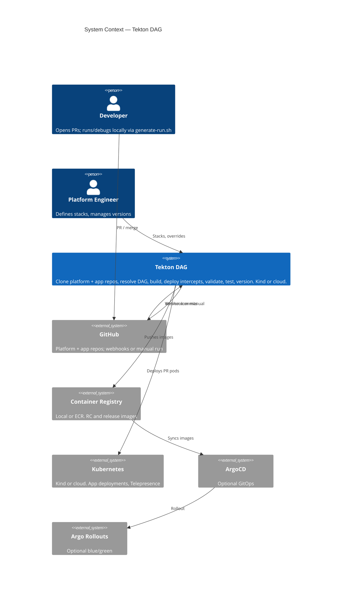
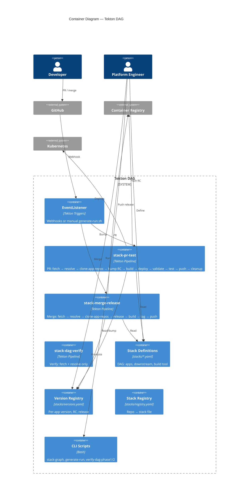

# tekton-dag

Standalone Tekton pipeline system for **local development and proof-of-concept**. No AWS. Run on Kind (or any Kubernetes) with a local registry and optional Telepresence. Proves out the stack DAG and pipelines locally; [share back to reference-architecture-poc](SHARING-BACK.md) when ready.

## Overview

**System context** — who uses the system and what it talks to:



> **Where is ArgoCD?** ArgoCD and Argo Rollouts are **not in this repo**. They are optional **downstream** systems (production): this repo’s pipelines push RC and release images to a container registry; in a full production setup, ArgoCD would sync from that registry and Argo Rollouts would perform blue/green promotion. For local/dev you only need Kind, Tekton, and the registry.

**Main pieces** — pipelines and config inside the system:



Full diagram set (PR/merge task-level, intercept scenarios, version lifecycle, stack resolution): [docs/c4-diagrams.md](docs/c4-diagrams.md).

## Quick start (local)

```bash
# 1. Kind cluster + local registry
./scripts/kind-with-registry.sh

# 2. Tekton + stack tasks/pipelines (labels namespace for Pod Security)
./scripts/install-tekton.sh

# 3. Optional: Telepresence Traffic Manager (for full PR pipeline with intercepts)
./scripts/install-telepresence-traffic-manager.sh

# 4. Optional: Postgres + Tekton Results (persist run history)
./scripts/install-postgres-kind.sh
./scripts/install-tekton-results.sh

# 5. Prove the DAG
./scripts/verify-dag-phase1.sh
# Phase 2 clones this repo; after push set GIT_URL to the repo URL:
export GIT_URL="https://github.com/jmjava/tekton-dag.git"
./scripts/verify-dag-phase2.sh

# 6. Full test + verify results in DB (after Results is installed)
./scripts/run-full-test-and-verify-results.sh

# Or run everything in one go (setup + test; idempotent). Run in your terminal:
#   cd /path/to/tekton-dag && ./scripts/run-all-setup-and-test.sh
./scripts/run-all-setup-and-test.sh
```

For manual pipeline runs, use `--registry localhost:5000 --storage-class ""`. See the full [README in docs](docs/README-FULL.md) (copied from the main design) for concepts, stack YAML, and pipeline flows.

## Run and debug the entire workflow on your machine

You can run and debug the **full** pipeline locally — no Jenkins, no shared CI queue, and direct access to logs and debuggers.

### Run the whole workflow locally

1. **One-time setup** (Kind, Tekton, tasks/pipelines, optional Telepresence + Results):
   ```bash
   ./scripts/run-all-setup-and-test.sh
   ```
   Or run the [Quick start](#quick-start-local) steps manually.

2. **Prove the DAG** (no cluster needed for Phase 1):
   ```bash
   ./scripts/verify-dag-phase1.sh
   export GIT_URL="https://github.com/jmjava/tekton-dag.git"
   ./scripts/verify-dag-phase2.sh
   ```

3. **Trigger a full PR or merge pipeline** (same as CI would run):
   ```bash
   kubectl apply -f tasks/
   kubectl apply -f pipeline/
   # PR pipeline (builds, deploys intercepts, validates, tests):
   ./scripts/generate-run.sh --mode pr --stack stack-one.yaml --app demo-fe --pr 42 \
     --registry localhost:5000 --storage-class "" | kubectl create -f -
   # Or merge pipeline (build, tag, push release):
   ./scripts/generate-run.sh --mode merge --stack stack-one.yaml --app demo-fe \
     --registry localhost:5000 --storage-class "" | kubectl create -f -
   ```

All of this runs on your machine: resolve, clone, build, deploy, validate, and test. No waiting on Jenkins or losing access to run details.

### Get direct debug and log access

- **Pipeline and task logs** — Use `kubectl` to watch runs and fetch logs:
  ```bash
  tkn pipelinerun list
  tkn pipelinerun logs <run-name> -f
  kubectl get pods -n tekton-pipelines
  kubectl logs <task-pod-name> -n tekton-pipelines -f
  ```
- **Optional: Tekton Results** — Install Postgres + Tekton Results to persist run history and query it (see Quick start steps 4 and 6).
- **Step-debug apps with VS Code** — Use the launch configs in `.vscode/launch.json` to run or attach to any app (Vue, Spring Boot, Flask, PHP, etc.). With Telepresence intercepts, traffic for a given PR/session can hit your local process so you can set breakpoints and step through the full stack. See [.vscode/README.md](.vscode/README.md) for the exact flow (start app with debugger → create intercept → trigger traffic).

So: run the entire workflow locally, inspect every step with `kubectl`/`tkn`, and step-debug any app in the DAG from your IDE.

## App repos (no monorepo)

Apps are **separate standalone Git repos**, not subdirectories of this repo. The pipeline (1) clones the **platform repo** (this repo, tekton-dag) for stacks and versions, (2) resolves the stack to get `build-apps`, then (3) **clones each app repo** from `stacks/*.yaml` (`.apps[].repo`, e.g. `jmjava/tekton-dag-vue-fe`) into `workspace/<app-name>` and builds. Create and push the sample app repos with `./scripts/create-and-push-sample-repos.sh` so the pipeline can clone them.

Clone the sample app repos into e.g. `~/github/jmjava` — see [sample-repos/README.md](sample-repos/README.md).

### Including sample repos in the VS Code workspace

The launch configs in `.vscode/launch.json` use **multi-root workspace folder** paths (e.g. `${workspaceFolder:tekton-dag-vue-fe}`). To run and debug apps from the IDE:

1. **Open a multi-root workspace** that includes this repo (tekton-dag) plus each sample app repo you care about (e.g. `~/github/jmjava/tekton-dag-vue-fe`, `~/github/jmjava/tekton-dag-spring-boot`).
2. **Add folders** via **File → Add Folder to Workspace…** and choose the cloned app repo directories.
3. **Folder names must match** what the launch configs expect. VS Code uses the **folder name** (last segment of the path) as the workspace folder identifier. Use exactly:
   - `tekton-dag-vue-fe`
   - `tekton-dag-spring-boot`
   - `tekton-dag-spring-boot-gradle`
   - `tekton-dag-spring-legacy`
   - `tekton-dag-flask`
   - `tekton-dag-php`
4. **Save the workspace** (File → Save Workspace As…) as e.g. `tekton-dag.code-workspace` in this repo so you can reopen it and get all roots + launch configs in one place.

After that, the Run and Debug dropdown will list configs like **Vue (demo-fe): Launch & debug** and **Spring Boot (release-lifecycle-demo): Attach**; they resolve `cwd` and sources from the matching workspace folder. See [.vscode/README.md](.vscode/README.md) for the step-debug flow with Telepresence intercepts.

## Layout

- **stacks/** — Stack YAML (DAG), registry, versions
- **tasks/** — Tekton tasks (resolve, clone-app-repos, build, deploy-intercept, validate, test, version, cleanup)
- **pipeline/** — stack-pr-test, stack-merge-release, stack-dag-verify
- **scripts/** — run-all-setup-and-test (run everything), kind-with-registry, install-tekton, install-postgres-kind, install-tekton-results, verify-dag-phase1/2, verify-results-in-db, run-full-test-and-verify-results, generate-run, stack-graph
- **docs/** — C4 diagrams, local DAG verification plan

## Sharing back to reference-architecture

See [SHARING-BACK.md](SHARING-BACK.md).
