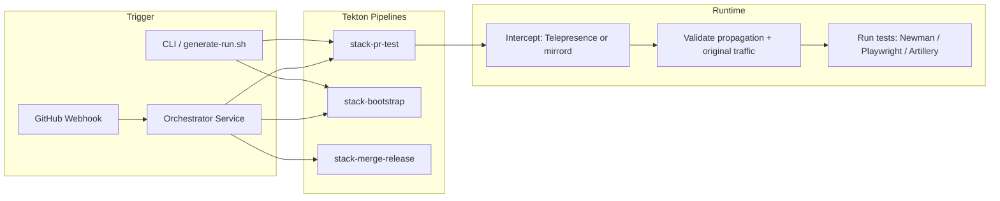
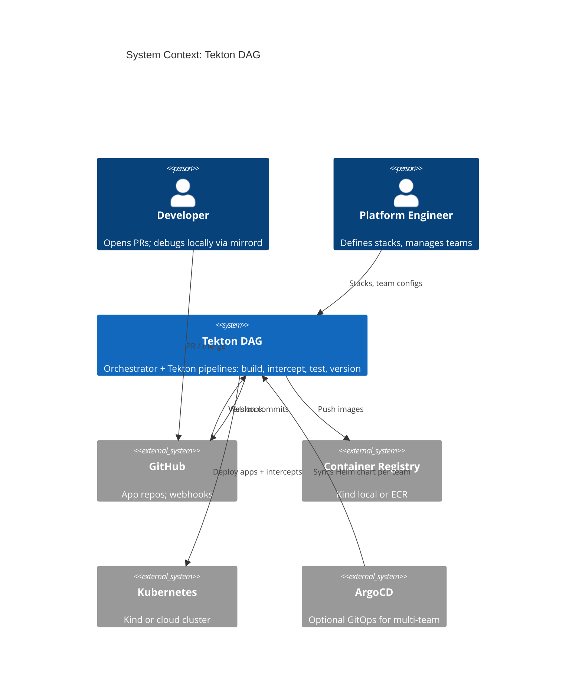
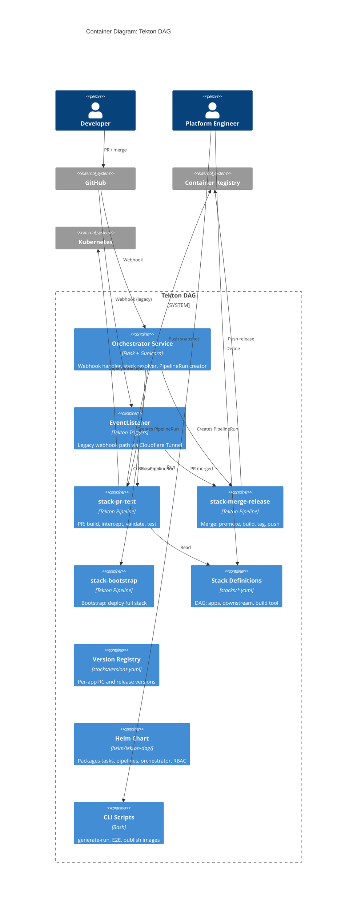

# tekton-dag

Standalone Tekton pipeline system for **local development and proof-of-concept**. Stack-aware CI/CD with header-based traffic interception, multi-framework support, and an in-cluster orchestration service.

## Demo Videos

🎬 **GitHub Pages (all segments + players):** [jmjava.github.io/tekton-dag/](https://jmjava.github.io/tekton-dag/)  
*Publishing & 404 troubleshooting: [docs/GITHUB-PAGES.md](docs/GITHUB-PAGES.md).*

Each row links to the **in-browser player** on Pages (`#seg-…`) and to the **composed MP4** in the repo. Anchors match [docs/index.html](docs/index.html).

### Platform Core (01–07)

| # | Video | Description | Duration | Watch | MP4 |
|---|-------|-------------|----------|-------|-----|
| 01 | Architecture Overview | System architecture, DAG model, polyglot support, pipelines | ~2:46 | [▶](https://jmjava.github.io/tekton-dag/#seg-01) | [`01-architecture.mp4`](docs/demos/recordings/01-architecture.mp4) |
| 02 | Quick Start | Kind cluster, Tekton install, image builds, task deployment | ~1:50 | [▶](https://jmjava.github.io/tekton-dag/#seg-02) | [`02-quickstart.mp4`](docs/demos/recordings/02-quickstart.mp4) |
| 03 | Bootstrap Dataflow | Stack bootstrap PipelineRun, header propagation, dependency resolution | ~2:30 | [▶](https://jmjava.github.io/tekton-dag/#seg-03) | [`03-bootstrap-dataflow.mp4`](docs/demos/recordings/03-bootstrap-dataflow.mp4) |
| 04 | PR Pipeline | Pull request flow, intercept setup, compile, containerize, test | ~2:30 | [▶](https://jmjava.github.io/tekton-dag/#seg-04) | [`04-pr-pipeline.mp4`](docs/demos/recordings/04-pr-pipeline.mp4) |
| 05 | Intercept Routing | PR vs normal traffic routing, header-based interception | ~2:06 | [▶](https://jmjava.github.io/tekton-dag/#seg-05) | [`05-intercept-routing.mp4`](docs/demos/recordings/05-intercept-routing.mp4) |
| 06 | Local Debugging | mirrord integration, IDE breakpoints, live cluster debugging | ~1:57 | [▶](https://jmjava.github.io/tekton-dag/#seg-06) | [`06-local-debug.mp4`](docs/demos/recordings/06-local-debug.mp4) |
| 07 | Merge & Release Pipeline | Version bump, compile, Crane tag, hook tasks, next-cycle push | ~2:30 | [▶](https://jmjava.github.io/tekton-dag/#seg-07) | [`07-merge-release.mp4`](docs/demos/recordings/07-merge-release.mp4) |

### Infrastructure (08–13)

| # | Video | Description | Duration | Watch | MP4 |
|---|-------|-------------|----------|-------|-----|
| 08 | Orchestrator API | REST API, stacks, test plan, graph queries | ~2:14 | [▶](https://jmjava.github.io/tekton-dag/#seg-08) | [`08-orchestrator.mp4`](docs/demos/recordings/08-orchestrator.mp4) |
| 09 | Multi-Team Helm | Helm chart, team isolation, namespace scoping, custom hooks | ~1:59 | [▶](https://jmjava.github.io/tekton-dag/#seg-09) | [`09-multi-team-helm.mp4`](docs/demos/recordings/09-multi-team-helm.mp4) |
| 10 | Baggage Middleware | Five-framework deep dive: Spring, Node, Flask, PHP propagation, W3C baggage | ~3:06 | [▶](https://jmjava.github.io/tekton-dag/#seg-10) | [`10-baggage-middleware.mp4`](docs/demos/recordings/10-baggage-middleware.mp4) |
| 11 | Testing Ecosystem | Newman API tests, Playwright E2E, Artillery load tests, regression tiers | ~2:00 | [▶](https://jmjava.github.io/tekton-dag/#seg-11) | [`11-testing-ecosystem.mp4`](docs/demos/recordings/11-testing-ecosystem.mp4) |
| 12 | Test-Trace Graph | Neo4j blast-radius analysis, graph-guided test selection | ~2:00 | [▶](https://jmjava.github.io/tekton-dag/#seg-12) | [`12-test-trace-graph.mp4`](docs/demos/recordings/12-test-trace-graph.mp4) |
| 13 | Tekton Results DB | Results API, persisted history, log retrieval, Postgres backing | ~1:40 | [▶](https://jmjava.github.io/tekton-dag/#seg-13) | [`13-results-db.mp4`](docs/demos/recordings/13-results-db.mp4) |

### Customization & GUI (14–18)

| # | Video | Description | Duration | Watch | MP4 |
|---|-------|-------------|----------|-------|-----|
| 14 | Customization | Stack schema, app entries, build variants, hook tasks, team onboarding, Helm values | ~3:06 | [▶](https://jmjava.github.io/tekton-dag/#seg-14) | [`14-customization.mp4`](docs/demos/recordings/14-customization.mp4) |
| 15 | Regression Suite | Full regression: local tiers, cluster checks, agent workflows | ~2:30 | [▶](https://jmjava.github.io/tekton-dag/#seg-15) | [`15-regression-suite.mp4`](docs/demos/recordings/15-regression-suite.mp4) |
| 16 | Management GUI | Vue 3 + Flask: team switcher, DAG view, runs, triggers, tests, Git browser | ~3:30 | [▶](https://jmjava.github.io/tekton-dag/#seg-16) | [`16-management-gui.mp4`](docs/demos/recordings/16-management-gui.mp4) |
| 17 | Extending the GUI | Five-step pattern: Flask route, pytest, Pinia store, Vue component, Playwright | ~2:36 | [▶](https://jmjava.github.io/tekton-dag/#seg-17) | [`17-extending-gui.mp4`](docs/demos/recordings/17-extending-gui.mp4) |
| 18 | What's Coming Next | Milestone 13 roadmap: retry, sizing, multi-cluster, reliability, observability | ~3:25 | [▶](https://jmjava.github.io/tekton-dag/#seg-18) | [`18-roadmap.mp4`](docs/demos/recordings/18-roadmap.mp4) |

### Concat Demos

| Name | Segments | Duration | Watch | MP4 |
|------|----------|----------|-------|-----|
| Full Demo | 01–13 | ~30 min | [▶](https://jmjava.github.io/tekton-dag/#full-demo) | [`full-demo.mp4`](docs/demos/recordings/full-demo.mp4) |
| Complete Demo | 01–18 | ~45 min | [▶](https://jmjava.github.io/tekton-dag/#full-demo-complete) | [`full-demo-complete.mp4`](docs/demos/recordings/full-demo-complete.mp4) |
| Platform Core | 01–07 | ~16 min | [▶](https://jmjava.github.io/tekton-dag/#platform-core) | [`platform-core.mp4`](docs/demos/recordings/platform-core.mp4) |

*All videos generated with [`docgen`](https://github.com/jmjava/documentation-generator) from Markdown narration + Manim animations. See [docs/demos/README.md](docs/demos/README.md).*

---

## Milestones

| Milestone | Status | Summary |
|-----------|--------|---------|
| [M4](milestones/milestone-4.md) | **Completed** | Baggage middleware + multi-namespace pipelines |
| [M4.1](milestones/milestone-4.1.md) | **Completed** | Standalone baggage libraries (Spring Boot, Node, Flask, PHP) |
| [M5](milestones/milestone-5.md) | **Completed** | Original traffic validation + mirrord evaluation |
| [M6](milestones/milestone-6.md) | **Completed** | Full MetalBear testing (all intercept scenarios) |
| [M7](milestones/milestone-7.md) | **Completed** | Dual intercept backend: Telepresence or mirrord via `intercept-backend` param |
| [M7.1](milestones/milestone-7-1.md) | **Completed** | Pipeline speed: parallel containerize, Kaniko cache, parallel clone |
| [M8](milestones/milestone-8.md) | **Partial** | Demo assets: Manim + TTS + composed segments + [GitHub Pages](https://jmjava.github.io/tekton-dag/); VHS terminal recordings, Slidev PDF, full concat still open |
| [M9](milestones/milestone-9.md) | **Completed** | Test-trace regression graph + minimal test selection (Neo4j, mock Datadog). 10 Newman requests, 36 assertions. Test filtering in PR pipeline. |
| [M10](milestones/milestone-10.md) | **Completed** | Multi-team scaling: orchestration service, Helm chart, ArgoCD, batched builds |
| [M10.1](milestones/milestone-10-1.md) | **Completed** | Orchestration service testing: Postman/Newman (15 requests, 30 assertions), integration validation |
| [M11](milestones/milestone-11.md) | **Completed** | Vue 3 Management GUI + Python/Flask backend (replaces `reporting-gui/`). Multi-team, multi-cluster, DAG visualization. 69 Playwright E2E tests, 56 pytest unit tests, Postman collection. |
| [M12](milestones/milestone-12.md) | **Completed** | Architecture customization: shared Python package, Helm ConfigMap/PVC templates, parameterized pipelines (no hardcoded `localhost:5000`), `scripts/common.sh`, build image variants (Java 11/17/21, Node 18/20/22, Python 3.10–3.12, PHP 8.1–8.3), custom pipeline hook tasks (pre/post build/test), stack JSON schema, 62 orchestrator pytest tests, 14 shared-package tests. Full docs: [CUSTOMIZATION.md](docs/CUSTOMIZATION.md), [TEAM-ONBOARDING-STACKS-AND-BAGGAGE.md](docs/TEAM-ONBOARDING-STACKS-AND-BAGGAGE.md), MAINTENANCE.md, Helm README. |
| [M12.2](milestones/milestone-12.2.md) | **Partial** | **Part A done:** doc sync + archive. **Part B open:** regression + Management GUI [docs & demo plan](docs/TESTING-AND-REGRESSION-OVERVIEW.md) / [GUI extension](docs/MANAGEMENT-GUI-EXTENSION.md) / [video segments](docs/demos/segments-m12-2-regression-gui.md) |
| [doc-generator](milestones/milestone-doc-generator.md) | **Completed** | Reusable Python library ([`docgen`](https://github.com/jmjava/documentation-generator)) extracting the demo pipeline (TTS, Manim, VHS, ffmpeg, validation, Pages). OCR validation, A/V sync, narration linting, auto-generated GitHub Pages. All 18 demo segments regenerated via `docgen`. |
| [M13](milestones/milestone-13.md) | **Planned** | Production hardening: retry on transient failures, precise build image sizing, multi-cluster push, operational reliability, observability, secrets injection (ESO/Sealed Secrets), per-app config per environment. See [segment 18](https://jmjava.github.io/tekton-dag/#seg-18) for video walkthrough. |

Older milestones (M2, M3) are in [milestones/completed/](milestones/completed/).

**Next up — [Milestone 13: Production Hardening](milestones/milestone-13.md):**

1. **Retry on transient failures** — task-level retries for build/deploy (not tests), spot eviction handling, registry throttle backoff, configurable retry counts, structured retry annotations
2. **Precise build image sizing** — per-tool resource profiles (Maven ≠ npm ≠ Kaniko), Helm-configurable, stack-level overrides, monitoring baseline
3. **Multi-cluster push** — remote registry push, promotion pipeline, cross-cluster deploy task, environment gates (manual approval), promotion audit trail in Tekton Results
4. **Operational reliability** — pipeline timeouts, graceful cleanup on timeout (`finally` block), health-check gates before tests, Results DB backup, Neo4j persistence
5. **Observability** — Prometheus metrics (build duration, test pass rate, retry count, queue time), alerting rules, cost attribution labels (team/stack/app)
6. **Secrets injection** — External Secrets Operator (ESO) integration, stack YAML `secrets` block (`env-from` + `volume-mounts`), deploy task wiring, ESO SecretStore per team, Sealed Secrets fallback, pre-deploy secret validation, Management GUI secret status panel
7. **Per-app config per environment** — stack YAML `config` block, Helm-templated ConfigMaps from `appConfig` values, environment overlay pattern (`values-local.yaml` / `values-staging.yaml` / `values-prod.yaml`), `.env.<app>` support for local dev, config validation hook, Management GUI config view

**Regression (humans & Cursor agents):** run **`scripts/run-regression-agent.sh`** and iterate with fixes until green — see [AGENTS.md](AGENTS.md) and [docs/AGENT-REGRESSION.md](docs/AGENT-REGRESSION.md). Full tier list: [docs/REGRESSION.md](docs/REGRESSION.md).

---

## What the system does


```mermaid
flowchart LR
  subgraph trigger [Trigger]
    Webhook[GitHub Webhook]
    Orchestrator[Orchestrator Service]
    CLI[CLI / generate-run.sh]
  end
  subgraph pipelines [Tekton Pipelines]
    PR[stack-pr-test]
    Bootstrap[stack-bootstrap]
    Merge[stack-merge-release]
  end
  subgraph runtime [Runtime]
    Intercept[Intercept: Telepresence or mirrord]
    Validate[Validate propagation + original traffic]
    Test[Run tests: Newman / Playwright / Artillery]
  end
  Webhook --> Orchestrator
  Orchestrator --> PR
  Orchestrator --> Bootstrap
  Orchestrator --> Merge
  CLI --> PR
  CLI --> Bootstrap
  PR --> Intercept --> Validate --> Test
```

**Three pipelines, one stack:**

| Pipeline | Purpose |
|----------|---------|
| **Bootstrap** (`stack-bootstrap`) | Deploy full stack once; prerequisite for PR runs. |
| **PR** (`stack-pr-test`) | Build changed app with snapshot tag, deploy intercepts, validate, test, post PR comment. No version bump. |
| **Merge** (`stack-merge-release`) | Promote RC to release, build, tag release images, push next dev cycle version commit. |

**Intercept backends:** Telepresence (default) or mirrord, selected via pipeline param `intercept-backend`. Both E2E-verified.

**Orchestration service** (M10): In-cluster Flask service that receives GitHub webhooks, resolves repo-to-stack dynamically, and creates PipelineRuns. Packaged via Helm chart with ArgoCD ApplicationSet for multi-team provisioning. See [docs/m10-multi-team-architecture.md](docs/m10-multi-team-architecture.md).

---

## Quick start (local)

```bash
# 1. Kind cluster + local registry
./scripts/kind-with-registry.sh

# 2. Tekton + stack tasks/pipelines
./scripts/install-tekton.sh

# 3. Publish build images to Kind registry (one-time)
./scripts/publish-build-images.sh

# 4. Apply tasks and pipelines
kubectl apply -f tasks/
kubectl apply -f pipeline/

# 5. Optional: Telepresence Traffic Manager (for PR pipeline intercepts)
./scripts/install-telepresence-traffic-manager.sh

# 6. Optional: Postgres + Tekton Results (persist run history)
./scripts/install-postgres-kind.sh
./scripts/install-tekton-results.sh

# 7. Bootstrap the stack (deploy all apps once)
./scripts/generate-run.sh --mode bootstrap --stack stack-one.yaml --apply

# 8. Run the full PR flow (create PR, test, merge)
./scripts/run-valid-pr-flow.sh --app demo-fe

# 9. Optional: orchestrator service
./scripts/publish-orchestrator-image.sh
kubectl apply -f orchestrator/k8s-deployment.yaml

# 10. Optional: webhooks via Cloudflare Tunnel
cloudflared tunnel run menkelabs-sso-tunnel-config &
kubectl port-forward svc/el-stack-event-listener 8080:8080 -n tekton-pipelines &
./scripts/configure-github-webhooks.sh --stack stack-one.yaml
```

---

## Regression testing

**E2E with intercepts** — runs bootstrap (optional) + PR pipeline + Tekton Results verification:

```bash
# Full run (bootstrap + PR pipeline)
./scripts/run-e2e-with-intercepts.sh --intercept-backend telepresence
./scripts/run-e2e-with-intercepts.sh --intercept-backend mirrord

# Skip bootstrap if stack is already deployed (saves ~8-12 min)
./scripts/run-e2e-with-intercepts.sh --intercept-backend telepresence --skip-bootstrap
./scripts/run-e2e-with-intercepts.sh --intercept-backend mirrord --skip-bootstrap
```

**Orchestrator service tests** — Newman suite against the live service (15 requests, 30 assertions):

```bash
./scripts/run-orchestrator-tests.sh
./scripts/run-orchestrator-tests.sh --skip-integration  # skip PipelineRun validation
```

---

## Architecture

### System context


```mermaid
C4Context
    title System Context: Tekton DAG

    Person(dev, "Developer", "Opens PRs; debugs locally via mirrord")
    Person(platform, "Platform Engineer", "Defines stacks, manages teams")

    System(tekton_std, "Tekton DAG", "Orchestrator + Tekton pipelines: build, intercept, test, version")

    System_Ext(github, "GitHub", "App repos; webhooks")
    System_Ext(registry, "Container Registry", "Kind local or ECR")
    System_Ext(k8s, "Kubernetes", "Kind or cloud cluster")
    System_Ext(argocd, "ArgoCD", "Optional GitOps for multi-team")

    Rel(dev, github, "PR / merge")
    Rel(github, tekton_std, "Webhook")
    Rel(tekton_std, registry, "Push images")
    Rel(tekton_std, k8s, "Deploy apps + intercepts")
    Rel(tekton_std, github, "Version commits")
    Rel(platform, tekton_std, "Stacks, team configs")
    Rel(argocd, tekton_std, "Syncs Helm chart per team")
```

### Container diagram


```mermaid
C4Container
    title Container Diagram: Tekton DAG

    Person(dev, "Developer")
    Person(platform, "Platform Engineer")

    System_Boundary(tekton_std, "Tekton DAG") {
        Container(orchestrator, "Orchestrator Service", "Flask + Gunicorn", "Webhook handler, stack resolver, PipelineRun creator")
        Container(event_listener, "EventListener", "Tekton Triggers", "Legacy webhook path via Cloudflare Tunnel")
        Container(pr_pipeline, "stack-pr-test", "Tekton Pipeline", "PR: build, intercept, validate, test")
        Container(merge_pipeline, "stack-merge-release", "Tekton Pipeline", "Merge: promote, build, tag, push")
        Container(bootstrap_pipeline, "stack-bootstrap", "Tekton Pipeline", "Bootstrap: deploy full stack")
        Container(stack_defs, "Stack Definitions", "stacks/*.yaml", "DAG: apps, downstream, build tool")
        Container(version_reg, "Version Registry", "stacks/versions.yaml", "Per-app RC and release versions")
        Container(helm_chart, "Helm Chart", "helm/tekton-dag/", "Packages tasks, pipelines, orchestrator, RBAC")
        Container(scripts, "CLI Scripts", "Bash", "generate-run, E2E, publish images")
    }

    System_Ext(github, "GitHub")
    System_Ext(registry, "Container Registry")
    System_Ext(k8s, "Kubernetes")

    Rel(dev, github, "PR / merge")
    Rel(github, orchestrator, "Webhook")
    Rel(github, event_listener, "Webhook (legacy)")
    Rel(orchestrator, pr_pipeline, "Creates PipelineRun")
    Rel(orchestrator, bootstrap_pipeline, "Creates PipelineRun")
    Rel(orchestrator, merge_pipeline, "Creates PipelineRun")
    Rel(event_listener, pr_pipeline, "PR opened")
    Rel(event_listener, merge_pipeline, "PR merged")
    Rel(pr_pipeline, stack_defs, "Read")
    Rel(pr_pipeline, registry, "Push snapshot")
    Rel(pr_pipeline, k8s, "Deploy intercepts")
    Rel(merge_pipeline, registry, "Push release")
    Rel(platform, stack_defs, "Define")
    Rel(platform, scripts, "Run")
```

Full diagram set: [docs/c4-diagrams.md](docs/c4-diagrams.md).

> **ArgoCD** is optional for local dev. In a **production deployment**, ArgoCD syncs the Helm chart per team via ApplicationSet (separate from the validation cluster where pipelines run). See [ArgoCD + Tekton architecture guide](docs/argocd-architecture-guide.md), [Environments and clusters](docs/ENVIRONMENTS-AND-CLUSTERS.md), and [argocd/applicationset.yaml](argocd/applicationset.yaml).

---

## DAG, baggage, and intercepts

The pipeline is driven by a **stack DAG** (directed acyclic graph): apps are nodes, `downstream` edges define who calls whom. Three **propagation roles** for the session header/baggage: **originator** (entry app, sets header), **forwarder** (middle, accepts and forwards), **terminal** (leaf, accepts only). On a PR run, only the **changed app** is built; intercepts route header-matching traffic to the PR pod. Full explanation: [docs/DAG-AND-PROPAGATION.md](docs/DAG-AND-PROPAGATION.md).

---

## Build images

Dedicated build images (one per tool) eliminate in-pod tool installation:

| Image | Base | Contents |
|-------|------|----------|
| `tekton-dag-build-node` | `node:22-slim` | Node 22 + npm + jq |
| `tekton-dag-build-maven` | `maven:3.9-eclipse-temurin-21` | JDK 21 + Maven + jq |
| `tekton-dag-build-gradle` | `eclipse-temurin:21-jdk` | JDK 21 + jq (apps use `./gradlew`) |
| `tekton-dag-build-python` | `python:3.12-slim` | Python 3.12 + pip + jq |
| `tekton-dag-build-php` | `php:8.3-cli` | PHP 8.3 + Composer + zip ext + jq |
| `tekton-dag-build-mirrord` | `bitnami/kubectl:latest` | mirrord CLI + jq + socat |
| `tekton-dag-orchestrator` | `python:3.12-slim` | Flask orchestration service |

```bash
./scripts/publish-build-images.sh          # compile images
./scripts/publish-orchestrator-image.sh    # orchestrator image
```

---

## Baggage libraries

Standalone middleware extracted into publishable libraries under `libs/`. Apps consume these as dependencies.

| Library | Package | Framework | Location |
|---------|---------|-----------|----------|
| `baggage-spring-boot-starter` | Maven | Spring Boot | `libs/baggage-spring-boot-starter/` |
| `baggage-servlet-filter` | Maven | Spring Legacy / WAR | `libs/baggage-servlet-filter/` |
| `@tekton-dag/baggage` | npm | Node (Express, Nitro, Vue) | `libs/baggage-node/` |
| `tekton-dag-baggage` | pip | Flask / WSGI | `libs/baggage-python/` |
| `tekton-dag/baggage-middleware` | Composer | PHP (PSR-15 + Guzzle) | `libs/baggage-php/` |

Build-time exclusion ensures production builds never include the library. See [milestones/milestone-4.1.md](milestones/milestone-4.1.md).

---

## Orchestration service (M10)

In-cluster Flask service that replaces script-driven orchestration for production-like deployments.

| Endpoint | Method | Description |
|----------|--------|-------------|
| `/healthz` | GET | Liveness probe |
| `/readyz` | GET | Readiness probe (stacks loaded count) |
| `/api/stacks` | GET | List registered stacks |
| `/api/teams` | GET | List team configs |
| `/api/runs` | GET | List recent PipelineRuns |
| `/api/run` | POST | Manual trigger (pr, bootstrap, or merge) |
| `/api/bootstrap` | POST | Trigger bootstrap pipeline |
| `/webhook/github` | POST | GitHub webhook handler |
| `/api/reload` | POST | Hot-reload stack and team configs |

Deploy:

```bash
./scripts/publish-orchestrator-image.sh
kubectl create configmap tekton-dag-stacks --from-file=stacks/ -n tekton-pipelines
kubectl apply -f orchestrator/k8s-deployment.yaml
```

Or via Helm: `./helm/tekton-dag/package.sh && helm install tekton-dag ./helm/tekton-dag -n tekton-pipelines`

See [docs/m10-multi-team-architecture.md](docs/m10-multi-team-architecture.md).

---

## Management GUI (M11)

Vue 3 + Python/Flask management GUI that replaces the legacy `reporting-gui/`. Located in `management-gui/`.

| Component | Stack | Location |
|-----------|-------|----------|
| Frontend | Vue 3, Vite, Pinia, Vue Router, Vue Flow | `management-gui/frontend/` |
| Backend | Python 3, Flask, Kubernetes Python client | `management-gui/backend/` |

**Features:** Trigger pipeline runs (PR/bootstrap/merge), monitor runs with status polling, drill into run detail with TaskRuns, filter test results, interactive DAG visualization of stack dependencies, browse Git repos (branches/tags/commits/PRs across all stack repos), embedded Tekton Dashboard, multi-team switcher with per-cluster context resolution.

**Deploy modes:** Centralized (all teams visible, team switcher) or per-team (`TEAM_NAME=alpha`, switcher hidden). Same codebase and image for both.

```bash
# Backend
cd management-gui/backend
python3 -m venv .venv && source .venv/bin/activate
pip install -r requirements.txt
flask run  # http://localhost:5000

# Frontend
cd management-gui/frontend
npm install
npm run dev  # http://localhost:3000 (proxies /api to Flask)
```

**Testing:**

```bash
# Backend unit tests (20 tests)
cd management-gui/backend && source .venv/bin/activate
pytest

# Frontend E2E tests (69 Playwright tests)
cd management-gui/frontend
npm run test:e2e

# Backend API tests (Postman/Newman)
newman run tests/postman/management-gui-tests.json --env-var baseUrl=http://localhost:5000
```

---

## Local development and debugging

Run the **full** pipeline locally — no Jenkins, no shared CI queue.

**Trigger pipelines:**

```bash
# PR pipeline
./scripts/generate-run.sh --mode pr --stack stack-one.yaml --app demo-fe --pr 42 \
  --app-revision demo-fe:my-branch --storage-class "" --apply

# Merge pipeline
./scripts/generate-run.sh --mode merge --stack stack-one.yaml --app demo-fe \
  --storage-class "" --apply
```

**Debug and logs:**

```bash
tkn pipelinerun list
tkn pipelinerun logs <run-name> -f
./scripts/install-tekton-dashboard.sh && ./scripts/port-forward-tekton-dashboard.sh  # http://localhost:9097
```

**Step-debug with intercepts:** Run an app locally with mirrord (or Telepresence), attach IDE debugger, set breakpoint, send request with intercept header — breakpoint fires with live cluster traffic. See [.vscode/README.md](.vscode/README.md).

**Restart from failure:** If the PR pipeline fails after build, continue from deploy without re-building:

```bash
./scripts/rerun-pr-from.sh <failed-pipelinerun-name>
```

---

## App repos (no monorepo)

Apps are **separate Git repos**, not subdirectories. The pipeline clones the platform repo (this repo) for stacks and versions, resolves the stack, then clones each app repo from `stacks/*.yaml` and builds. Create sample repos with `./scripts/create-and-push-sample-repos.sh`.

VS Code multi-root workspace configs in `.vscode/launch.json` support debugging all frameworks. See [.vscode/README.md](.vscode/README.md).

---

## Registry setup (Kind)

| Container | Host port | In-cluster address | Purpose |
|-----------|-----------|-------------------|---------|
| `kind-registry` | `localhost:5001` | `localhost:5000` | Kind cluster registry — push here, pods pull via `localhost:5000` |

Pod image refs must use `localhost:5000`. Kind's containerd config redirects to `kind-registry:5000` on the Docker network.

---

## Webhooks (Cloudflare Tunnel)

```
GitHub → https://tekton-el.menkelabs.com → Cloudflare Tunnel → localhost:8080 → EventListener
```

Setup: [docs/CLOUDFLARE-TUNNEL-EVENTLISTENER.md](docs/CLOUDFLARE-TUNNEL-EVENTLISTENER.md).

---

## Secrets and GitGuardian

All secrets belong in `.env` (gitignored). Use [.env.example](.env.example) as a template.

Pre-commit hook runs GitGuardian ggshield: `pip install pre-commit && pre-commit install`.

---

## Layout

| Directory | Contents |
|-----------|----------|
| `stacks/` | Stack YAML (DAG definitions), [registry.yaml](stacks/registry.yaml), [versions.yaml](stacks/versions.yaml) |
| `tasks/` | Tekton tasks: resolve-stack, clone-app-repos, build-compile-*, build-containerize, deploy-full-stack, deploy-intercept, deploy-intercept-mirrord, validate-propagation, validate-original-traffic, run-stack-tests, pr-snapshot-tag, version-bump, tag-release-images, post-pr-comment, cleanup-stack |
| `pipeline/` | stack-pr-test, stack-merge-release, stack-bootstrap, stack-pr-continue, stack-dag-verify, triggers |
| `orchestrator/` | Flask orchestration service: app.py, routes.py, stack_resolver.py, pipelinerun_builder.py, k8s_client.py, Dockerfile, k8s-deployment.yaml |
| `helm/tekton-dag/` | Helm chart: packages tasks, pipelines, orchestrator deployment, RBAC |
| `argocd/` | ArgoCD AppProject and ApplicationSet for multi-team provisioning |
| `teams/` | Per-team config (team.yaml, values.yaml) for multi-team data model |
| `build-images/` | Dockerfiles and build script for pre-built compile images |
| `libs/` | Standalone baggage middleware libraries (Spring Boot, Node, Flask, PHP) |
| `scripts/` | CLI scripts: generate-run, publish-build-images, publish-orchestrator-image, run-e2e-with-intercepts, run-orchestrator-tests, run-valid-pr-flow, kind-with-registry, install-tekton, install-tekton-results, and more |
| `management-gui/` | Vue 3 + Flask management GUI (frontend + backend). See [Management GUI](#management-gui-m11) |
| `tests/postman/` | Postman/Newman collections (orchestrator-tests.json, management-gui-tests.json) |
| `docs/` | Architecture docs, diagrams, guides. See [docs/README.md](docs/README.md) |
| `milestones/` | Milestone planning and status docs |
| `session-notes/` | Session notes and debugging logs |
| `reporting-gui/` | Vue + Node reporting GUI. See [reporting-gui/README.md](reporting-gui/README.md) |
| `sample-repos/` | Scripts for creating sample app repos |
| `config/` | Kubernetes manifests (Postgres for Tekton Results) |
| `.vscode/` | Launch configs and debug setup for all app frameworks |

---

## References

- [docs/DAG-AND-PROPAGATION.md](docs/DAG-AND-PROPAGATION.md) — stack DAG and header propagation
- [docs/c4-diagrams.md](docs/c4-diagrams.md) — full diagram set
- [docs/PR-TEST-FLOW.md](docs/PR-TEST-FLOW.md) — valid PR test flow
- [docs/m10-multi-team-architecture.md](docs/m10-multi-team-architecture.md) — multi-team architecture
- [docs/argocd-architecture-guide.md](docs/argocd-architecture-guide.md) — ArgoCD + Tekton together
- [docs/bootstrap-pipeline-speed-analysis.md](docs/bootstrap-pipeline-speed-analysis.md) — pipeline speed analysis
- [docs/m7-mirrord-intercept-task.md](docs/m7-mirrord-intercept-task.md) — mirrord intercept task
- [docs/demo-playbook.md](docs/demo-playbook.md) — demo recording playbook
- [docs/README-FULL.md](docs/README-FULL.md) — full design doc
- [SHARING-BACK.md](SHARING-BACK.md) — sharing back to reference-architecture
