# C4 Architecture Diagrams — Tekton Job Standardization

## Level 1: System Context

Who interacts with the system and what external systems does it depend on.

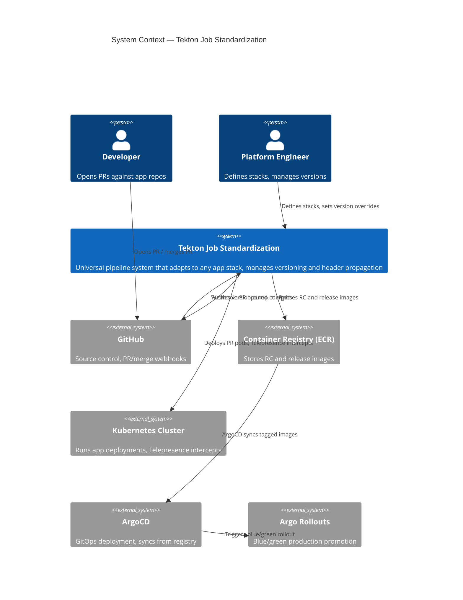

## Level 2: Container Diagram

The major components inside the standardization system.

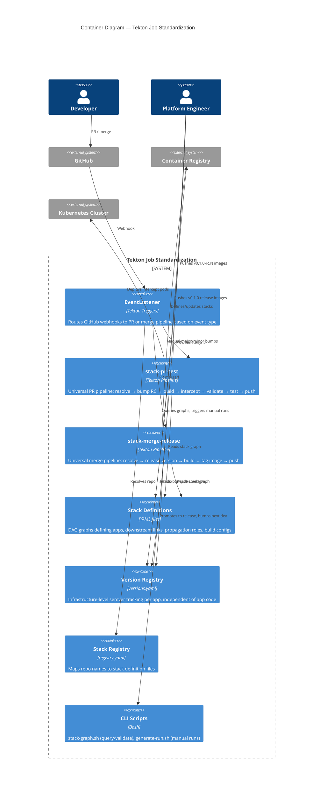

## Level 3: Component Diagram — PR Pipeline

The Tekton Tasks inside the PR pipeline and how they interact.

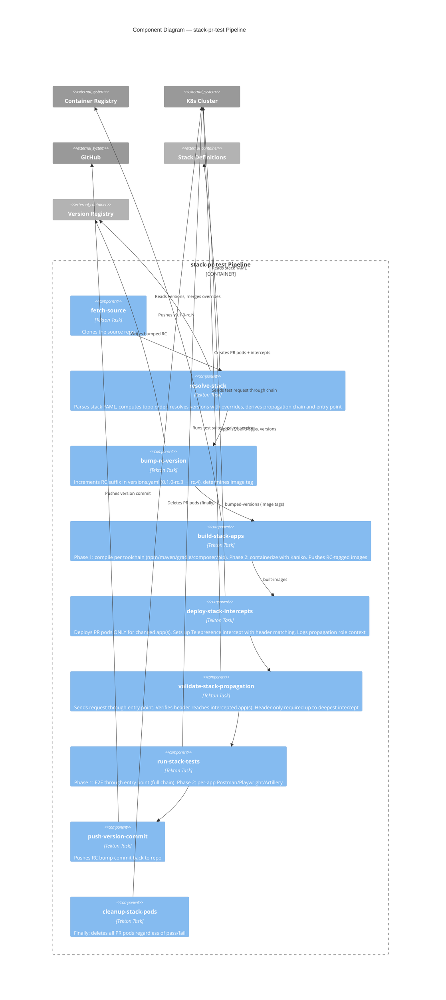

## Level 3: Component Diagram — Merge Pipeline

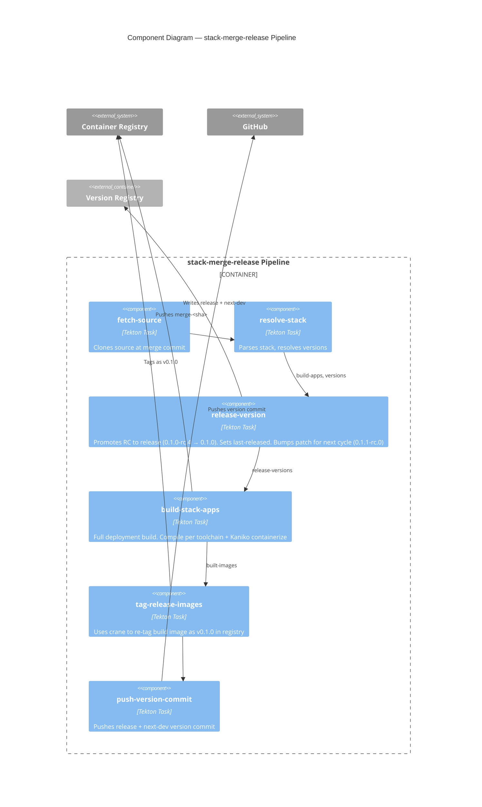

## Dynamic Diagram: PR Intercept Scenarios

How the system behaves when different apps in a stack are intercepted.

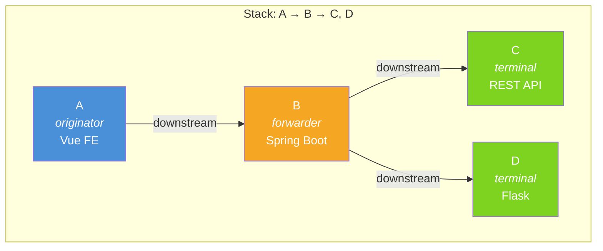

### Scenario 1: B (forwarder) is intercepted

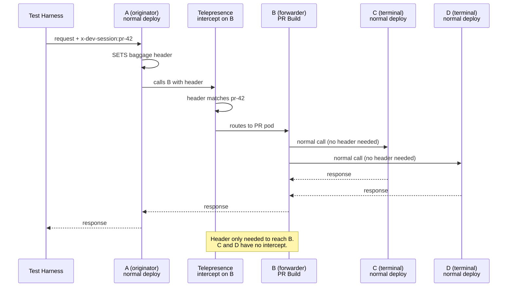

### Scenario 2: C (terminal) is intercepted

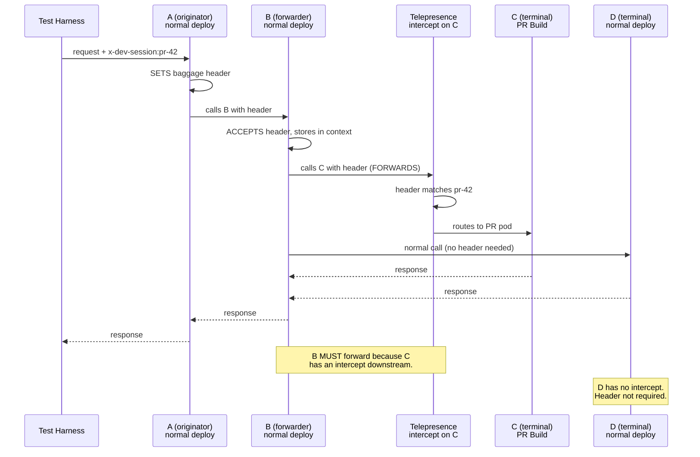

### Scenario 3: B AND C both intercepted

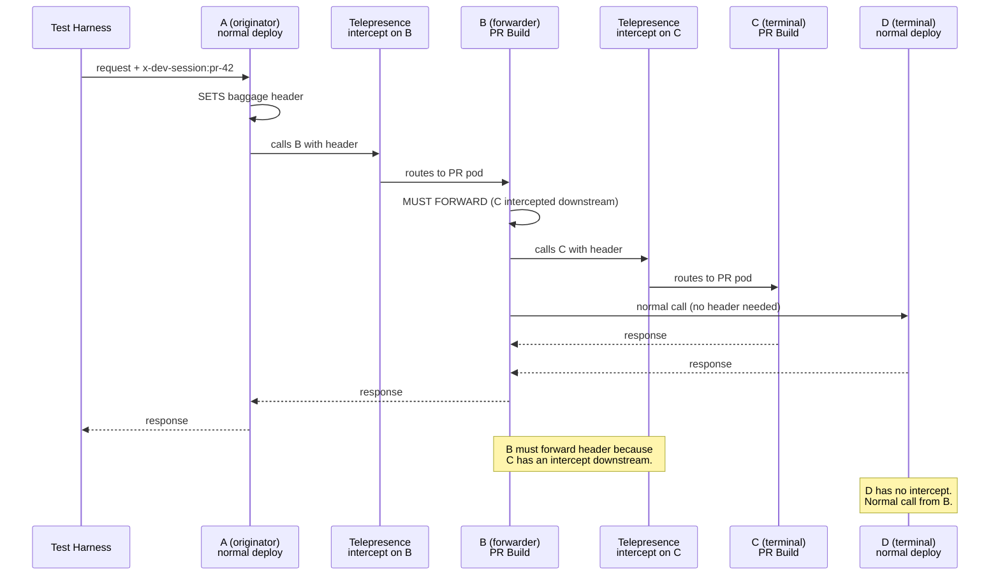

### Scenario 4: A (originator) is intercepted

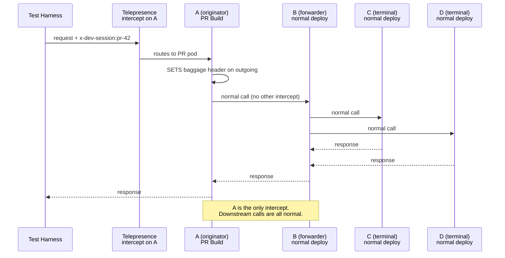

## Dynamic Diagram: Version Lifecycle

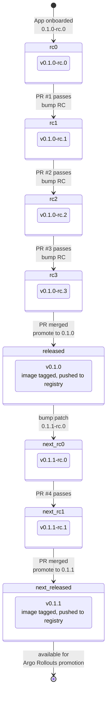

## Dynamic Diagram: Build Toolchain Selection

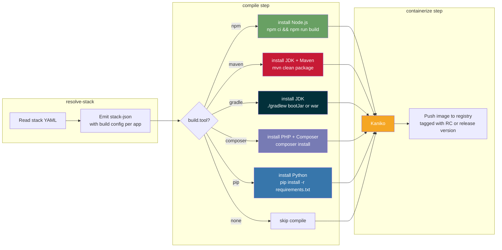

## Dynamic Diagram: Stack Graph Resolution

How the system processes an arbitrary DAG at runtime.

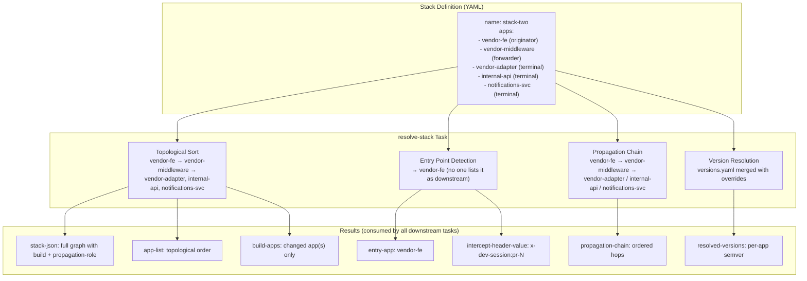
