# C4 Architecture Diagrams — Tekton DAG (current code)

These diagrams reflect the **current** pipeline and task layout: platform repo (tekton-dag) with `stacks/` and `versions.yaml`; app repos are **separate** Git repos cloned per stack. The control plane is CRD-primary: the orchestrator (or `generate-run.sh`) creates a **StackRun**; the operator reconciles it to a Tekton **PipelineRun**. Runs locally on Kind or in cloud.

## Level 1: System Context

Who interacts with the system and what external systems it depends on.

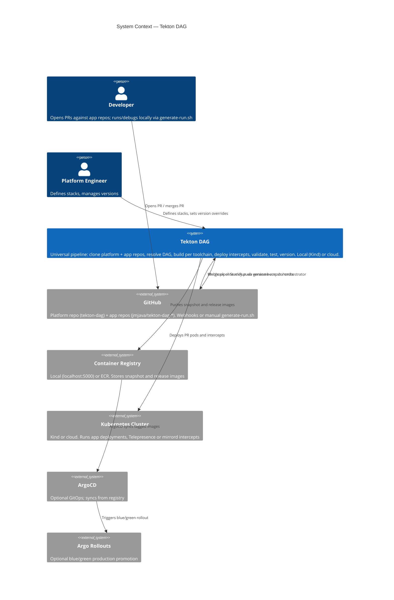
```mermaid
C4Context
    title System Context — Tekton DAG

    Person(dev, "Developer", "Opens PRs against app repos; runs/debugs locally via generate-run.sh")
    Person(platform, "Platform Engineer", "Defines stacks, manages versions")

    System(tekton_std, "Tekton DAG", "Universal pipeline: clone platform + app repos, resolve DAG, build per toolchain, deploy intercepts, validate, test, version. Local (Kind) or cloud.")

    System_Ext(github, "GitHub", "Platform repo (tekton-dag) + app repos (jmjava/tekton-dag-*). Webhooks or manual generate-run.sh")
    System_Ext(registry, "Container Registry", "Local (localhost:5000) or ECR. Stores snapshot and release images")
    System_Ext(k8s, "Kubernetes Cluster", "Kind or cloud. Runs app deployments, Telepresence or mirrord intercepts")
    System_Ext(argocd, "ArgoCD", "Optional GitOps; syncs from registry")
    System_Ext(argo_rollouts, "Argo Rollouts", "Optional blue/green production promotion")

    Rel(dev, github, "Opens PR / merges PR")
    Rel(github, tekton_std, "Webhook or StackRun via generate-run.sh / orchestrator")
    Rel(tekton_std, registry, "Pushes snapshot and release images")
    Rel(tekton_std, k8s, "Deploys PR pods and intercepts")
    Rel(tekton_std, github, "Merge pipeline may push version-bump commits")
    Rel(platform, tekton_std, "Defines stacks, sets version overrides")
    Rel(registry, argocd, "ArgoCD syncs tagged images")
    Rel(argocd, argo_rollouts, "Triggers blue/green rollout")
```

## Level 2: Container Diagram

The major components inside the system (platform repo + pipelines + config).

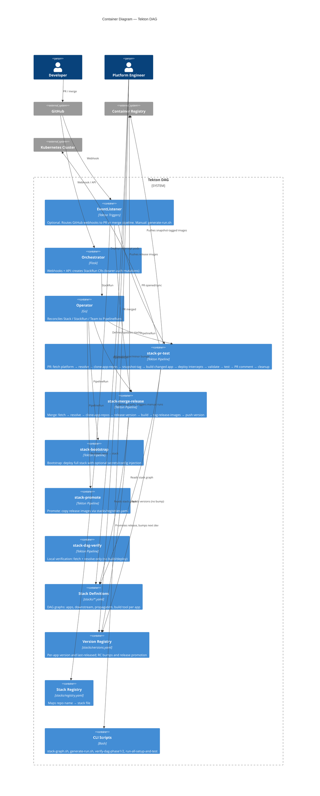
```mermaid
C4Container
    title Container Diagram — Tekton DAG

    Person(dev, "Developer")
    Person(platform, "Platform Engineer")

    System_Boundary(tekton_std, "Tekton DAG") {

        Container(event_listener, "EventListener", "Tekton Triggers", "Optional. Routes GitHub webhooks to PR or merge pipeline. Manual: generate-run.sh")

        Container(orchestrator, "Orchestrator", "Flask", "Webhooks + API: creates StackRun CRs (bearer-auth mutations)")

        Container(operator, "Operator", "Go", "Reconciles Stack / StackRun / Team to PipelineRuns")

        Container(pr_pipeline, "stack-pr-test", "Tekton Pipeline", "PR: fetch platform → resolve → clone-app-repos → snapshot-tag → build changed app → deploy intercepts → validate → test → PR comment → cleanup")

        Container(merge_pipeline, "stack-merge-release", "Tekton Pipeline", "Merge: fetch → resolve → clone-app-repos → release version → build → tag-release-images → push version")

        Container(bootstrap_pipeline, "stack-bootstrap", "Tekton Pipeline", "Bootstrap: deploy full stack with optional secrets/config injection")

        Container(promote_pipeline, "stack-promote", "Tekton Pipeline", "Promote: copy release images via stacks/registries.yaml")

        Container(dag_verify, "stack-dag-verify", "Tekton Pipeline", "Local verification: fetch + resolve only (no build/deploy)")

        Container(stack_defs, "Stack Definitions", "stacks/*.yaml", "DAG graphs: apps, downstream, propagation, build tool per app")

        Container(version_reg, "Version Registry", "stacks/versions.yaml", "Per-app version and last-released; RC bumps and release promotion")

        Container(stack_registry, "Stack Registry", "stacks/registry.yaml", "Maps repo name → stack file")

        Container(scripts, "CLI Scripts", "Bash", "stack-graph.sh, generate-run.sh, verify-dag-phase1/2, run-all-setup-and-test")
    }

    System_Ext(github, "GitHub")
    System_Ext(registry, "Container Registry")
    System_Ext(k8s, "Kubernetes Cluster")

    Rel(dev, github, "PR / merge")
    Rel(github, event_listener, "Webhook")
    Rel(github, orchestrator, "Webhook / API")
    Rel(event_listener, pr_pipeline, "PR opened/sync")
    Rel(event_listener, merge_pipeline, "PR merged")
    Rel(orchestrator, operator, "StackRun")
    Rel(operator, pr_pipeline, "PipelineRun")
    Rel(operator, merge_pipeline, "PipelineRun")
    Rel(operator, bootstrap_pipeline, "PipelineRun")
    Rel(operator, promote_pipeline, "PipelineRun")
    Rel(pr_pipeline, stack_defs, "Reads stack graph")
    Rel(pr_pipeline, version_reg, "Reads versions (no bump)")
    Rel(merge_pipeline, stack_defs, "Reads stack graph")
    Rel(merge_pipeline, version_reg, "Promotes release, bumps next dev")
    Rel(event_listener, stack_registry, "Resolves repo → stack")
    Rel(pr_pipeline, registry, "Pushes snapshot-tagged images")
    Rel(pr_pipeline, k8s, "Deploys intercept pods")
    Rel(merge_pipeline, registry, "Pushes release images")
    Rel(platform, stack_defs, "Defines/updates stacks")
    Rel(platform, version_reg, "Manual major/minor bumps")
    Rel(platform, scripts, "Queries graphs, triggers manual runs")
```

## Level 3: Component Diagram — PR Pipeline

The Tekton Tasks inside **stack-pr-test** and how they interact (current code).

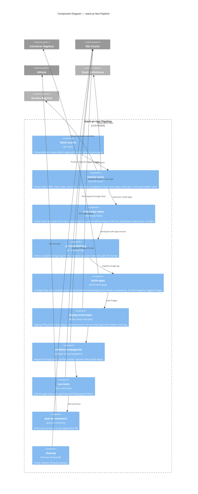
```mermaid
C4Component
    title Component Diagram — stack-pr-test Pipeline

    Container_Boundary(pr_pipeline, "stack-pr-test Pipeline") {

        Component(fetch_source, "fetch-source", "git-clone", "Clones platform repo (tekton-dag) with stacks/ and versions.yaml")

        Component(resolve, "resolve-stack", "resolve-stack", "Parses stack YAML, topo order, versions + overrides, propagation chain, entry-app, build-apps, intercept-header-value")

        Component(clone_apps, "clone-app-repos", "clone-app-repos", "Clones each app repo from stack .apps[].repo (e.g. jmjava/tekton-dag-vue-fe) into workspace/<app-name> via SSH")

        Component(snapshot, "pr-snapshot-tag", "pr-snapshot-tag", "Emits a snapshot image tag for the changed app (not a versions.yaml RC bump)")

        Component(build, "build-apps", "build-stack-apps", "Changed app only: compile (npm/maven/gradle/composer/pip) then Kaniko containerize. Pushes snapshot-tagged images")

        Component(deploy, "deploy-intercepts", "deploy-stack-intercepts", "Deploys PR pods for build-apps, Telepresence or mirrord intercept with header matching")

        Component(validate, "validate-propagation", "validate-stack-propagation", "Request through entry; verifies header reaches intercepted app(s)")

        Component(test, "run-tests", "run-stack-tests", "E2E through entry; per-app Postman/Playwright/Artillery")

        Component(comment, "post-pr-comment", "post-pr-comment", "Posts test summary on the application PR")

        Component(cleanup, "cleanup", "cleanup-stack-pods", "Finally: deletes PR pods (always)")
    }

    System_Ext(registry, "Container Registry")
    System_Ext(k8s, "K8s Cluster")
    System_Ext(github, "GitHub")
    Container_Ext(stack_defs, "Stack Definitions")
    Container_Ext(version_reg, "Version Registry")

    Rel(fetch_source, resolve, "workspace")
    Rel(resolve, stack_defs, "Reads stack YAML")
    Rel(resolve, version_reg, "Reads versions, overrides")
    Rel(resolve, clone_apps, "stack-json, build-apps")
    Rel(clone_apps, snapshot, "workspace with app sources")
    Rel(snapshot, build, "snapshot image tag")
    Rel(build, registry, "Pushes snapshot-tagged images")
    Rel(build, deploy, "built-images")
    Rel(deploy, k8s, "Creates PR pods + intercepts")
    Rel(deploy, validate, " ")
    Rel(validate, k8s, "Test request through chain")
    Rel(validate, test, " ")
    Rel(test, k8s, "Runs test suites")
    Rel(test, comment, "test-summary")
    Rel(comment, github, "PR comment")
    Rel(cleanup, k8s, "Deletes PR pods (finally)")
```

## Level 3: Component Diagram — Merge Pipeline

The Tekton Tasks inside **stack-merge-release** (current code).

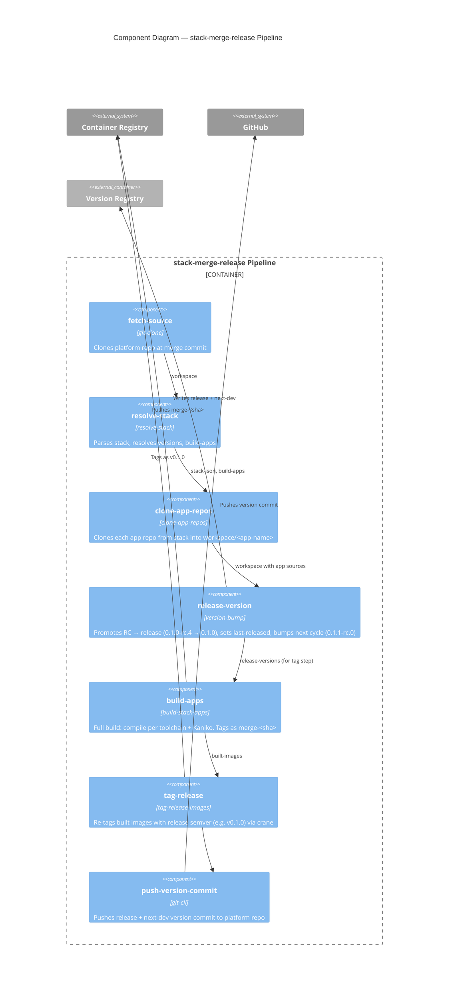
```mermaid
C4Component
    title Component Diagram — stack-merge-release Pipeline

    Container_Boundary(merge_pipeline, "stack-merge-release Pipeline") {

        Component(fetch_source, "fetch-source", "git-clone", "Clones platform repo at merge commit")

        Component(resolve, "resolve-stack", "resolve-stack", "Parses stack, resolves versions, build-apps")

        Component(clone_apps, "clone-app-repos", "clone-app-repos", "Clones each app repo from stack into workspace/<app-name>")

        Component(release_ver, "release-version", "version-bump", "Promotes RC → release (0.1.0-rc.4 → 0.1.0), sets last-released, bumps next cycle (0.1.1-rc.0)")

        Component(build, "build-apps", "build-stack-apps", "Full build: compile per toolchain + Kaniko. Tags as merge-<sha>")

        Component(tag, "tag-release", "tag-release-images", "Re-tags built images with release semver (e.g. v0.1.0) via crane")

        Component(push_ver, "push-version-commit", "git-cli", "Pushes release + next-dev version commit to platform repo")
    }

    System_Ext(registry, "Container Registry")
    System_Ext(github, "GitHub")
    Container_Ext(version_reg, "Version Registry")

    Rel(fetch_source, resolve, "workspace")
    Rel(resolve, clone_apps, "stack-json, build-apps")
    Rel(clone_apps, release_ver, "workspace with app sources")
    Rel(release_ver, version_reg, "Writes release + next-dev")
    Rel(release_ver, build, "release-versions (for tag step)")
    Rel(build, registry, "Pushes merge-<sha>")
    Rel(build, tag, "built-images")
    Rel(tag, registry, "Tags as v0.1.0")
    Rel(tag, push_ver, " ")
    Rel(push_ver, github, "Pushes version commit")
```

## Dynamic Diagram: PR Intercept Scenarios

How the system behaves when different apps in a stack are intercepted.

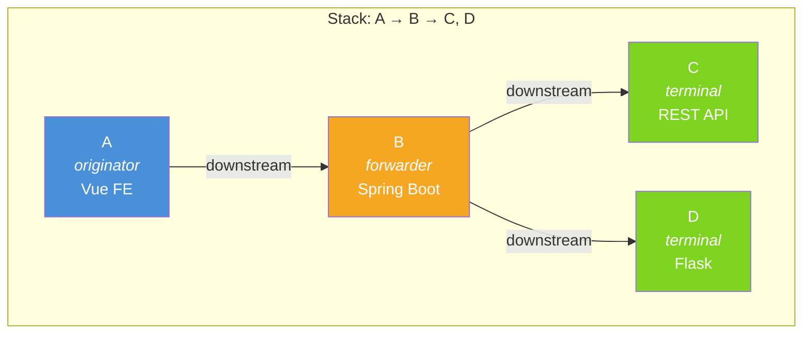
```mermaid
flowchart TB
    subgraph stack["Stack: A → B → C, D"]
        A["A<br/><i>originator</i><br/>Vue FE"]
        B["B<br/><i>forwarder</i><br/>Spring Boot"]
        C["C<br/><i>terminal</i><br/>REST API"]
        D["D<br/><i>terminal</i><br/>Flask"]
        A -->|downstream| B
        B -->|downstream| C
        B -->|downstream| D
    end

    style A fill:#4a90d9,color:#fff
    style B fill:#f5a623,color:#fff
    style C fill:#7ed321,color:#fff
    style D fill:#7ed321,color:#fff
```

### Scenario 1: B (forwarder) is intercepted

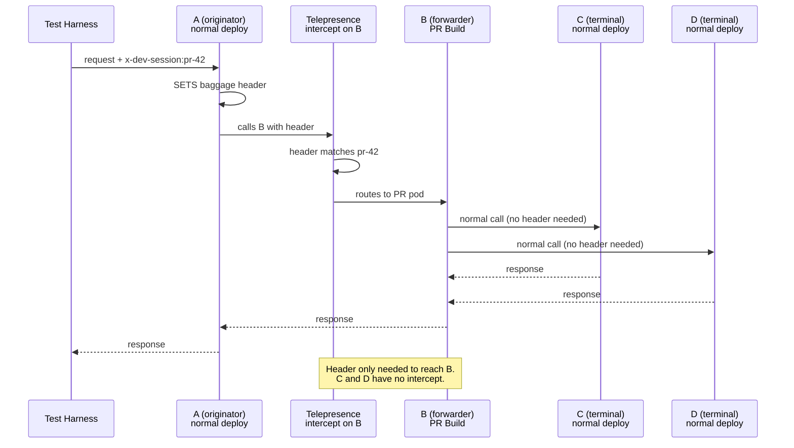
```mermaid
sequenceDiagram
    participant Test as Test Harness
    participant A as A (originator)<br/>normal deploy
    participant TP_B as Telepresence<br/>intercept on B
    participant B_PR as B (forwarder)<br/>PR Build
    participant C as C (terminal)<br/>normal deploy
    participant D as D (terminal)<br/>normal deploy

    Test->>A: request + x-dev-session:pr-42
    A->>A: SETS baggage header
    A->>TP_B: calls B with header
    TP_B->>TP_B: header matches pr-42
    TP_B->>B_PR: routes to PR pod
    B_PR->>C: normal call (no header needed)
    B_PR->>D: normal call (no header needed)
    C-->>B_PR: response
    D-->>B_PR: response
    B_PR-->>A: response
    A-->>Test: response

    Note over TP_B,B_PR: Header only needed to reach B.<br/>C and D have no intercept.
```

### Scenario 2: C (terminal) is intercepted

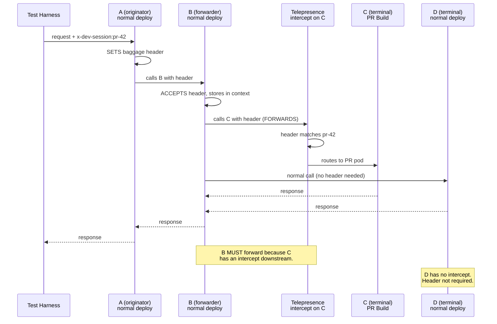
```mermaid
sequenceDiagram
    participant Test as Test Harness
    participant A as A (originator)<br/>normal deploy
    participant B as B (forwarder)<br/>normal deploy
    participant TP_C as Telepresence<br/>intercept on C
    participant C_PR as C (terminal)<br/>PR Build
    participant D as D (terminal)<br/>normal deploy

    Test->>A: request + x-dev-session:pr-42
    A->>A: SETS baggage header
    A->>B: calls B with header
    B->>B: ACCEPTS header, stores in context
    B->>TP_C: calls C with header (FORWARDS)
    TP_C->>TP_C: header matches pr-42
    TP_C->>C_PR: routes to PR pod
    B->>D: normal call (no header needed)
    C_PR-->>B: response
    D-->>B: response
    B-->>A: response
    A-->>Test: response

    Note over B,TP_C: B MUST forward because C<br/>has an intercept downstream.
    Note over D: D has no intercept.<br/>Header not required.
```

### Scenario 3: B AND C both intercepted

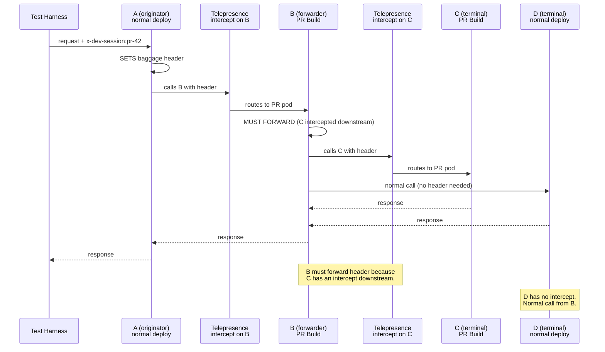
```mermaid
sequenceDiagram
    participant Test as Test Harness
    participant A as A (originator)<br/>normal deploy
    participant TP_B as Telepresence<br/>intercept on B
    participant B_PR as B (forwarder)<br/>PR Build
    participant TP_C as Telepresence<br/>intercept on C
    participant C_PR as C (terminal)<br/>PR Build
    participant D as D (terminal)<br/>normal deploy

    Test->>A: request + x-dev-session:pr-42
    A->>A: SETS baggage header
    A->>TP_B: calls B with header
    TP_B->>B_PR: routes to PR pod
    B_PR->>B_PR: MUST FORWARD (C intercepted downstream)
    B_PR->>TP_C: calls C with header
    TP_C->>C_PR: routes to PR pod
    B_PR->>D: normal call (no header needed)
    C_PR-->>B_PR: response
    D-->>B_PR: response
    B_PR-->>A: response
    A-->>Test: response

    Note over B_PR,TP_C: B must forward header because<br/>C has an intercept downstream.
    Note over D: D has no intercept.<br/>Normal call from B.
```

### Scenario 4: A (originator) is intercepted

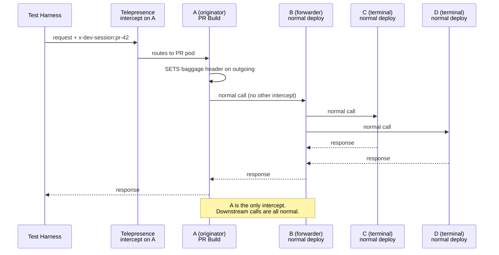
```mermaid
sequenceDiagram
    participant Test as Test Harness
    participant TP_A as Telepresence<br/>intercept on A
    participant A_PR as A (originator)<br/>PR Build
    participant B as B (forwarder)<br/>normal deploy
    participant C as C (terminal)<br/>normal deploy
    participant D as D (terminal)<br/>normal deploy

    Test->>TP_A: request + x-dev-session:pr-42
    TP_A->>A_PR: routes to PR pod
    A_PR->>A_PR: SETS baggage header on outgoing
    A_PR->>B: normal call (no other intercept)
    B->>C: normal call
    B->>D: normal call
    C-->>B: response
    D-->>B: response
    B-->>A_PR: response
    A_PR-->>Test: response

    Note over A_PR,B: A is the only intercept.<br/>Downstream calls are all normal.
```

## Dynamic Diagram: Version Lifecycle

PR runs use **snapshot image tags** and do not advance `stacks/versions.yaml`. Merge/release promotes the release tag and bumps the next development cycle. Optional `stack-promote` copies that release into another registry.

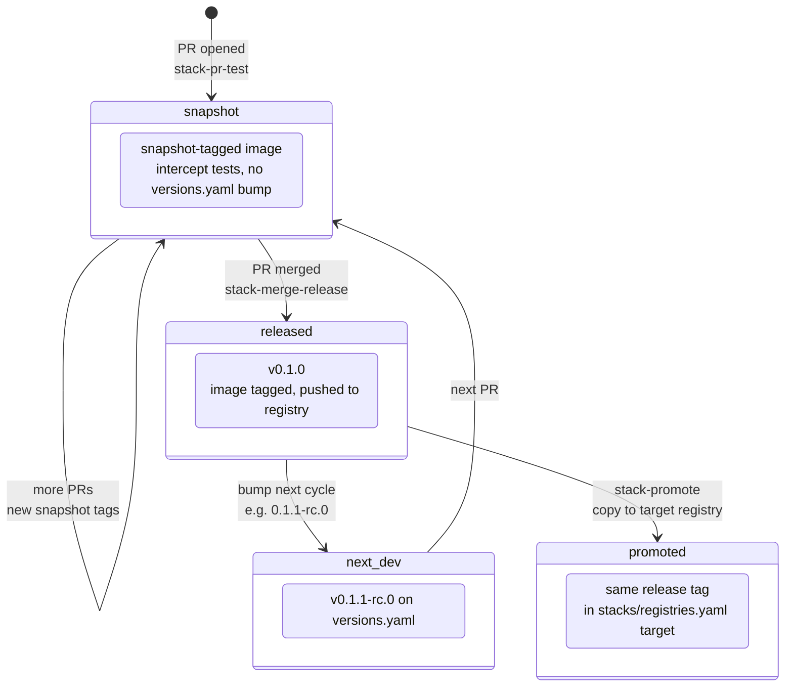
```mermaid
stateDiagram-v2
    [*] --> snapshot: PR opened<br/>stack-pr-test
    snapshot --> snapshot: more PRs<br/>new snapshot tags
    snapshot --> released: PR merged<br/>stack-merge-release
    released --> next_dev: bump next cycle<br/>e.g. 0.1.1-rc.0
    next_dev --> snapshot: next PR
    released --> promoted: stack-promote<br/>copy to target registry

    state snapshot {
        [*]: snapshot-tagged image<br/>intercept tests, no versions.yaml bump
    }
    state released {
        [*]: v0.1.0<br/>image tagged, pushed to registry
    }
    state next_dev {
        [*]: v0.1.1-rc.0 on versions.yaml
    }
    state promoted {
        [*]: same release tag<br/>in stacks/registries.yaml target
    }
```

## Dynamic Diagram: Build Toolchain Selection

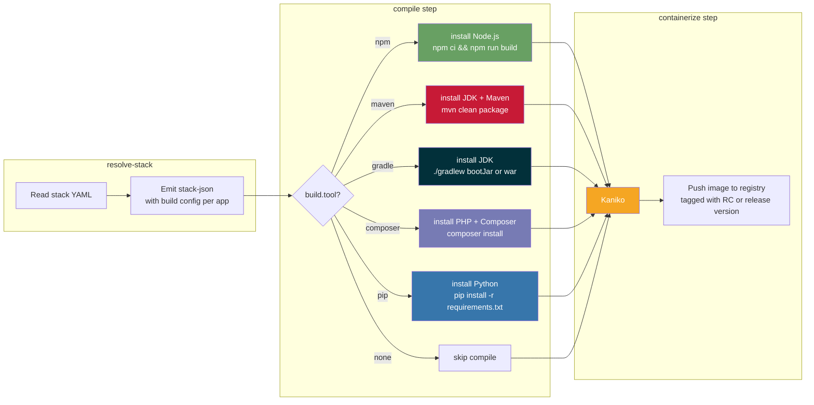
```mermaid
flowchart LR
    subgraph resolve["resolve-stack"]
        R[Read stack YAML] --> J[Emit stack-json<br/>with build config per app]
    end

    subgraph compile["compile step"]
        J --> SW{build.tool?}
        SW -->|npm| NPM["install Node.js<br/>npm ci && npm run build"]
        SW -->|maven| MVN["install JDK + Maven<br/>mvn clean package"]
        SW -->|gradle| GRD["install JDK<br/>./gradlew bootJar or war"]
        SW -->|composer| PHP["install PHP + Composer<br/>composer install"]
        SW -->|pip| PIP["install Python<br/>pip install -r requirements.txt"]
        SW -->|none| SKIP["skip compile"]
    end

    subgraph containerize["containerize step"]
        NPM --> K[Kaniko]
        MVN --> K
        GRD --> K
        PHP --> K
        PIP --> K
        SKIP --> K
        K --> IMG["Push image to registry<br/>tagged with RC or release version"]
    end

    style NPM fill:#68a063,color:#fff
    style MVN fill:#c71a36,color:#fff
    style GRD fill:#02303a,color:#fff
    style PHP fill:#777bb4,color:#fff
    style PIP fill:#3776ab,color:#fff
    style K fill:#f5a623,color:#fff
```

## Dynamic Diagram: Stack Graph Resolution

How **resolve-stack** processes an arbitrary DAG at runtime. Example matches **stacks/stack-two-vendor.yaml** and **stacks/registry.yaml**.

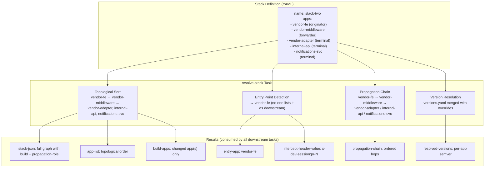
```mermaid
flowchart TB
    subgraph input["Stack Definition (YAML)"]
        YAML["name: stack-two<br/>apps:<br/>  - vendor-fe (originator)<br/>  - vendor-middleware (forwarder)<br/>  - vendor-adapter (terminal)<br/>  - internal-api (terminal)<br/>  - notifications-svc (terminal)"]
    end

    subgraph resolve["resolve-stack Task"]
        TOPO["Topological Sort<br/>vendor-fe → vendor-middleware →<br/>vendor-adapter, internal-api, notifications-svc"]
        ENTRY["Entry Point Detection<br/>→ vendor-fe (no one lists it as downstream)"]
        CHAIN["Propagation Chain<br/>vendor-fe → vendor-middleware →<br/>vendor-adapter / internal-api / notifications-svc"]
        VER["Version Resolution<br/>versions.yaml merged with overrides"]
    end

    subgraph output["Results (consumed by all downstream tasks)"]
        O1["stack-json: full graph with build + propagation-role"]
        O2["app-list: topological order"]
        O3["entry-app: vendor-fe"]
        O4["propagation-chain: ordered hops"]
        O5["resolved-versions: per-app semver"]
        O6["build-apps: changed app(s) only"]
        O7["intercept-header-value: x-dev-session:pr-N"]
    end

    YAML --> TOPO
    YAML --> ENTRY
    YAML --> CHAIN
    YAML --> VER
    TOPO --> O1
    TOPO --> O2
    ENTRY --> O3
    CHAIN --> O4
    VER --> O5
    TOPO --> O6
    ENTRY --> O7
```
