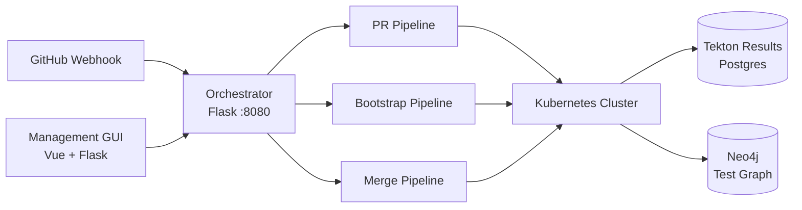
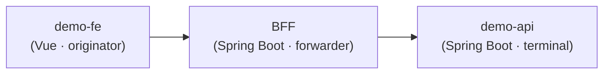
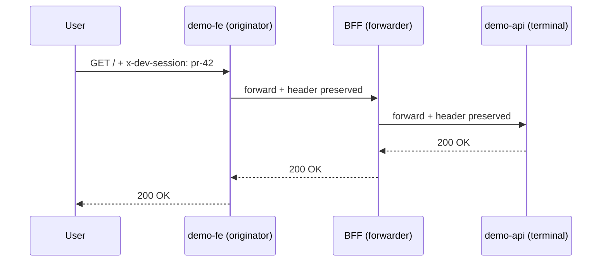
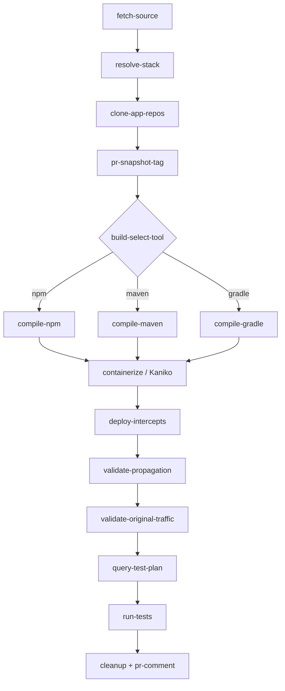
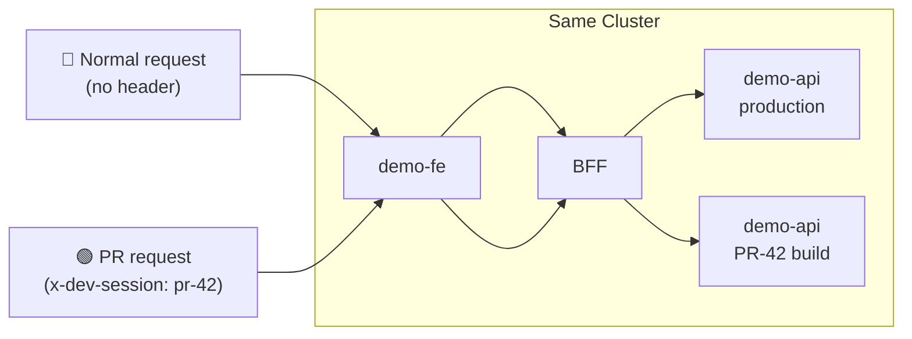
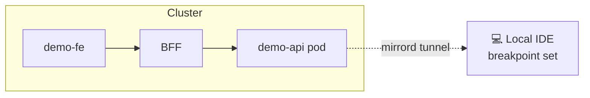
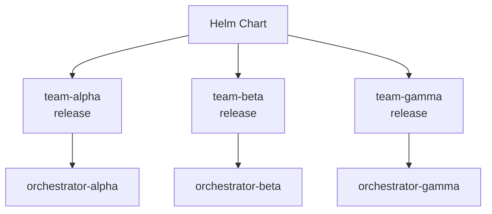
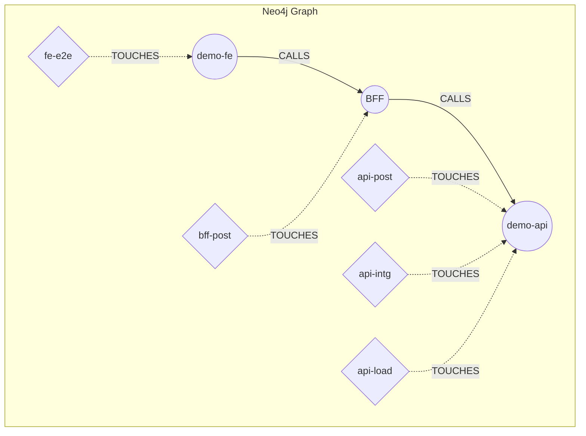

# tekton-dag

**Stack-Aware CI/CD with Header-Based Traffic Interception**

Built on Tekton Pipelines · Polyglot · Multi-team

---

## Architecture

Webhook → Orchestrator → PipelineRun → Kubernetes · Results DB · Test Graph

---

## Stack DAG — The Core Model

Each app declares:
- **Build tool**: npm, Maven, Gradle, pip, Composer
- **Propagation role**: originator → forwarder → terminal
- **Tests**: Postman, Playwright, Artillery

Stack YAML is the single source of truth.

---

## Polyglot — 5 Build Toolchains

| Tool | Languages | Version variants |
|------|-----------|-----------------|
| **npm** | Node 18, 20, 22 | `tekton-dag-build-node:node22` |
| **Maven** | Java 11, 17, 21 | `tekton-dag-build-maven:java21` |
| **Gradle** | Java 11, 17, 21 | `tekton-dag-build-gradle:java17` |
| **pip** | Python 3.10–3.12 | `tekton-dag-build-python:python312` |
| **Composer** | PHP 8.1–8.3 | `tekton-dag-build-php:php83` |

Parameterized Dockerfiles + `build-and-push.sh --matrix`

---

## Header Propagation — x-dev-session

Header propagation enables per-request routing to PR builds.

---

## PR Pipeline — Build Only What Changed

---

## Intercept Routing — PR vs Normal Traffic

- **Telepresence** or **mirrord** — one parameter switch
- Multiple concurrent PRs, each isolated by header value
- Cleanup in pipeline `finally` block

---

## Local Debug with mirrord

- `mirrord exec` mirrors cluster traffic to your laptop
- Real requests, real headers, real downstream calls
- Full breakpoint debugging with live data
- No mocks, no SSH into pods

---

## Custom Pipeline Hooks (M12)

| Hook | When | Example |
|------|------|---------|
| `pre-build-task` | After clone, before compile | Code generation, license scan |
| `post-build-task` | After containerize, before deploy | Image scan, SBOM |
| `pre-test-task` | After deploy, before tests | Seed test data |
| `post-test-task` | After tests (finally block) | Slack notification |

All optional — empty string skips the hook. Teams customize without forking pipelines.

---

## Multi-Team Helm Deployment

- Each team gets isolated ConfigMaps, orchestrator, and pipeline runs
- `compileImageVariants` per team (e.g. Java 17 vs 21)
- Management GUI provides team switcher

---

## Tekton Results — Pipeline History

- **Results API + Watcher** → Postgres
- Every PipelineRun and TaskRun persisted automatically
- Query historical runs, durations, outcomes
- `verify-results-in-db.sh` validates data
- Management GUI surfaces run history

---

## Test-Trace Graph — Blast Radius

- **Radius 1**: direct tests for changed app
- **Radius 2**: tests for neighbor services
- `query-test-plan` task → focused test execution

---

## 23 Tekton Tasks

**Source**
- resolve-stack
- clone-app-repos
- build-select-tool-apps

**Build**
- compile-npm/maven/gradle/pip/composer
- build-containerize
- pr-snapshot-tag

**Deploy & Test**
- deploy-full-stack
- deploy-intercept (telepresence)
- deploy-intercept-mirrord
- validate-propagation
- validate-original-traffic
- query-test-plan
- run-stack-tests

Plus: cleanup, version-bump, tag-release-images, post-pr-comment, 2 example hooks

---

## Demo Asset Toolchain

| Tool | Produces |
|------|----------|
| **Manim** | 6 animated architecture videos |
| **VHS** | 7 terminal recording GIFs/MP4s |
| **OpenAI TTS** | 11 narration audio tracks |
| **ffmpeg** | Composed segment + full demo videos |
| **Slidev** | This presentation |

All generated from source: `./docs/demos/generate-all.sh`

---
layout: center
---

# Thank You

**tekton-dag** — Stack-aware CI/CD with header-based traffic interception

GitHub: `jmjava/tekton-dag`

All demo assets generated programmatically — no manual recording

