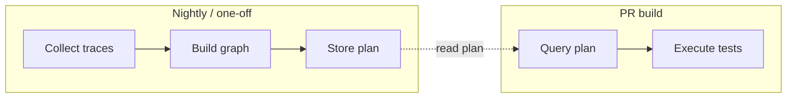

# Milestone 9: Test-trace–driven regression graph and minimal test selection

> **Planned.** Use traces from nightly regression to build a system test graph, then select the minimal set of regression tests for a given change. This flow is **integrated into the existing PR pipeline** (stack-pr-test) so the same PR run queries the plan and runs only the selected tests. The test system has no real Datadog; we simulate the Datadog REST API with mock returns and generated data.

## Goal

Use traces from nightly regression runs to build a **system test graph** (nodes = services/endpoints, edges = calls observed during tests). Use that graph to (a) know which tests touch which parts of the system, and (b) select the **minimal set of regression tests** for a given change area. In production, Datadog would be the source; in **this test system there is no real Datadog** — we **simulate** the Datadog REST API with **mock returns** and **generate infrastructure test data** so the full flow can be demonstrated and the result made **available to the CI engine** to determine which tests to invoke for a given app change.

**Scope:** Mock API, data generator, CI-facing output. No dependency on a real Datadog account in the repo/test system.

---

## Background

- **Stack DAG today:** [docs/DAG-AND-PROPAGATION.md](../docs/DAG-AND-PROPAGATION.md) and [stacks/stack-one.yaml](../stacks/stack-one.yaml) define an **application** DAG: nodes = apps, edges = `downstream` (caller → callee). There is no “system test graph” yet.
- **Tracing:** [milestones/milestone-4.md](milestone-4.md) and baggage libs mention OpenTelemetry/Datadog-compatible baggage. There is no existing nightly regression pipeline or Datadog integration in the repo.
- **Milestone 9** introduces a **test-centric** graph: nodes/edges come from **observed trace data** during test runs (which services/endpoints each test hits), not only from the static stack YAML.

---

## End-to-end flow (idea → actual running tests)

The system must proceed from **idea to actual running tests** as the end point. All four stages are required; success means a single run can go **collect → store → query → execute** and the chosen tests **actually run** in the CI build.

| Stage | What happens | Deliverable |
|-------|--------------|--------------|
| **1. Collect** | Call (mock) Datadog REST APIs to fetch traces from nightly regression (or use pre-generated trace payloads). | Mock server/fixtures; graph-builder job that calls the API and parses response. |
| **2. Store** | Persist the derived graph and test→nodes/edges mapping so it can be queried later. | Storage design: e.g. file in workspace, Postgres table, or Tekton Results–backed store; schema for test plan / graph. |
| **3. Query** | Given a change (file/method or node), query the stored plan to get the list of tests to run (or unmapped-area result). | Query step: input = change; output = test IDs (or "no mapped regression; area needs regression built"). |
| **4. Execute** | CI build (Tekton) runs **only** the selected tests (e.g. Postman collections/suites, Playwright tests). | Pipeline/task that receives the test list (param or artifact) and **executes** those specific tests; pass/fail reported in CI. |

---

## Integration with the PR pipeline

The M9 flow is **worked into the PR build that already runs in the repo** — the **stack-pr-test** pipeline ([pipeline/stack-pr-pipeline.yaml](../pipeline/stack-pr-pipeline.yaml)) triggered by the EventListener for PR opened/synchronized. It is not a separate pipeline; the same PR run performs **query** and **execute** using the stored plan.

- **Current PR pipeline:** `stack-pr-test` does: fetch-source → resolve-stack → clone-app-repos → build (compile, containerize) → deploy-intercepts → validate-propagation / validate-original-traffic → **run-tests** ([tasks/run-stack-tests.yaml](../tasks/run-stack-tests.yaml)) → finally cleanup, post-pr-comment. The trigger already supplies **changed-app** (from the PR base repo name via [pipeline/triggers.yaml](../pipeline/triggers.yaml) and stack-pr-binding).

- **Collect & Store:** May be done outside the PR run (e.g. nightly job or one-off) that calls the mock Datadog API, builds the graph, and persists the plan. The PR pipeline must have **access** to that stored plan (e.g. ConfigMap, PVC, or a small service the query task calls). Implementation must specify where the plan is stored and how the PR run reads it.

- **Query in the PR build:** Add a task (e.g. **compute-minimal-tests** or **query-test-plan**) that runs during the PR pipeline — after **resolve-stack** (so changed-app and stack are known) and before **run-tests**. Inputs: **changed-app** (from pipeline param) and optionally changed files (e.g. from a task that runs `git diff` against base). The task reads the stored plan, resolves change → node/area, and outputs either (a) the list of test IDs to run, or (b) unmapped-area + message "no mapped regression; identify as needing regression built." Output must be consumable by the next task (e.g. result or workspace file).

- **Execute in the PR build:** The existing **run-tests** task ([tasks/run-stack-tests.yaml](../tasks/run-stack-tests.yaml)) must be extended to accept an optional **tests-to-run** (and optionally **unmapped-area**). When **tests-to-run** is provided, run only those tests (filter Phase 1/2 to the given list). When **unmapped-area** is set (and tests-to-run empty), do not run the full suite; report "no mapped regression in area X; identify as needing regression built" (e.g. in test-summary result and post-pr-comment) and optionally run a minimal smoke set. The pipeline must pass the query task output into run-tests.

- **Pipeline wiring:** In [pipeline/stack-pr-pipeline.yaml](../pipeline/stack-pr-pipeline.yaml): insert the new query task after deploy-intercepts (or after validate-*) and before run-tests. Pass changed-app (and optionally changed-files result) into the query task; pass the query task result (test list or unmapped) into run-tests. Ensure the continuation pipeline ([pipeline/stack-pr-continue-pipeline.yaml](../pipeline/stack-pr-continue-pipeline.yaml)) can also supply tests-to-run / unmapped when re-running only the test phase.

---

## Pillar 1: Recording traces and building the system test graph

- **System test graph:** Nodes = services or endpoints (or both) observed in traces; edges = caller → callee (or test → service) observed during test execution.
- **Trace source:** Tests run in a pipeline (e.g. Tekton nightly); app under test (and optionally test harness) emit traces; traces are sent to Datadog (in this repo, we use a **mock**).
- **Requirement:** Each trace (or span) must be **tagged with test identity** (e.g. test name, suite, run id) so we can map “test T” → “spans/nodes/edges observed when T ran.”

### Tagging test identity

Regression tests run **outside** the CI/build framework (Postman, Playwright, Artillery, etc.). To associate each test with the graph of edges it hits, every **request** made by the test must carry a stable **test identity** that propagates through the stack and appears in span metadata.

**Recommended: HTTP header (e.g. `X-Test-Id`)**

- Add a single header to every outgoing request from the test client. Value format: stable and parseable, e.g. `postman/regression/smoke-fe-flow`, `playwright.checkout.full-flow`.
- **Propagation:** Apps in the stack must **forward** this header on downstream HTTP calls (same as `x-dev-session` today). Then every span in the trace will see the header and the graph builder can tag spans with it.
- **Association:** Query “all traces where X-Test-Id=foo” → get all spans in those traces → extract service/endpoint names and caller→callee → that is the set of edges hit by test foo.

**Postman:** Set a collection/folder variable (e.g. `testId`). In Pre-request Script: `pm.request.headers.add({ key: 'X-Test-Id', value: pm.collectionVariables.get('testId') || pm.info.requestName })`.

**Playwright:** In `beforeEach` or a fixture: `page.setExtraHTTPHeaders({ 'X-Test-Id': test.info().titlePath().join('.') })`. For APIRequestContext, add the header to every request.

**Artillery:** Add a global header or `beforeRequest` hook that sets `X-Test-Id` (e.g. scenario name).

**Alternative:** Put the test id in the `baggage` header; apps that already propagate baggage will carry it through.

---

## Pillar 2: Minimal regression set

- **“Work in a particular area”** = changed service(s), changed endpoint(s), or changed edges (e.g. “BFF” or “all calls into demo-api”).
- **Minimal set** = all tests whose recorded traces **touch** that area (nodes or edges). Optionally include tests that touch upstream/downstream (impact analysis).
- **Query design:** Input = area (node/edge/service or changed-app); output = list of test IDs to run (or unmapped-area + message).

---

## Pillar 3: Creating the graph via Datadog REST API (mock in this repo)

- The **graph is created** by calling the Datadog REST API to fetch traces (e.g. by time window and tag filters), then parsing the response into **test → (nodes, edges)** and optionally an **aggregate DAG**.
- In this test system we use a **mock** that implements the published Datadog REST API endpoints and response schemas; no real Datadog account is required.
- Persist or expose the result so it is **searchable** (e.g. by team, CI, or API) — e.g. store in a DB, expose via REST API or CLI.

---

## Mock Datadog API and generated test data

The test system **does not have Datadog**. To demonstrate the full flow (traces → graph → minimal test set → CI invokes only those tests), we simulate the API and generate data.

**1. Simulate the Datadog REST API**

- Implement a **mock server** or **static fixture** that responds to the **published** Datadog REST API paths (e.g. list traces, get trace, search spans) and returns **mock** JSON matching the published shape (trace list with spans, resource names, tags such as `X-Test-Id`, service names). The graph-builder and test-selector code call “Datadog” (the mock) so the rest of the pipeline can run in CI without a real Datadog account.

**2. Generate infrastructure test data — complex enough to show realistic mapping**

- **Expand the mock data** so the graph is **complex enough** to show realistic behaviour: e.g. changing **node A** (or a file/method mapped to node A) results in a test plan that includes **Postman tests a, b, c** and **Playwright tests g, h**. The mock trace payloads and derived graph must support: multiple tests per node, multiple test types (Postman, Playwright), and a test plan that lists concrete test IDs by type.
- Use the same app/service names as in [stacks/stack-one.yaml](../stacks/stack-one.yaml) (demo-fe, release-lifecycle-demo, demo-api) and optionally map **file/method** to node.
- **Sample inputs and expected outputs:** (1) Change to node A → test plan = Postman a, b, c + Playwright g, h. (2) Change to node B → different set. (3) Change to an area with **no mapped tests** → unmapped result (see below).

**3. Test engine simulates change; system generates test plan**

- The test engine (or demo harness) **simulates a change** to a **file or method** (or node). The system **generates the test plan** based on that change: maps the change to a node/area, looks up which tests touch that node/area from the graph, and outputs the list of tests to run (or unmapped result). That test plan is what CI consumes.
- **Unmapped case:** When the change is in an **area that has no mapped regression tests** (e.g. new service, new code path), the system must **output that no mapped regression was found** and **identify that area as needing regression (tests) to be built**. Example: `{ "tests": [], "unmapped_area": "node-C", "message": "No mapped regression found in area; identify as needing regression built" }`. This case must be **tested**.

**4. Expose result to the CI engine**

- The output of the query (test list or unmapped-area) must be **consumable by the CI engine** (Tekton). Options: pipeline parameter or workspace file; artifact from the query task; or small REST API/CLI that the pipeline calls. CI determines which tests to invoke (or that the area needs regression built) from this output.

---

## Test engine and test cases

All of the following cases must be **tested** (automated or as documented scenarios) so the system is reliable and demonstrable:

| Case | Description | Expected outcome |
|------|-------------|------------------|
| **1. Mapped change, single node** | Simulate change to node A (or file/method mapped to A). | Test plan = e.g. Postman a, b, c + Playwright g, h. CI runs only those tests; verify correct selection. |
| **2. Mapped change, different node** | Simulate change to node B. | Different test set. Verify no cross-talk (tests for A do not run when B changed). |
| **3. Unmapped change / new functionality** | Simulate change to an area with **no mapped regression tests**. | Output: **no mapped regression found in area [X]; identify as needing regression built**. System must explicitly flag that the area needs regression coverage. |
| **4. (Optional)** | Change that touches multiple nodes or an edge. | Union of test sets; or tests that hit that edge. |

The mock data and test engine must support triggering each case (e.g. a “changed node” or “changed file” input for a node with no tests in the graph for Case 3).

---

## Deliverables (implementation)

- **Mock server or fixtures** conforming to Datadog REST API shape.
- **Richer mock data** (complex enough that e.g. node A → Postman a,b,c + Playwright g,h); data generator or curated mock data.
- **Graph-builder job** that calls the (mock) API and builds test→nodes/edges; **storage** for the plan (location and schema).
- **Query task** (e.g. query-test-plan or compute-minimal-tests) used in the PR pipeline; inputs: changed-app, optionally changed files; output: test list or unmapped-area.
- **Extended run-stack-tests task** with optional params **tests-to-run** and **unmapped-area**; when provided, run only listed tests or report unmapped.
- **Pipeline updates:** [pipeline/stack-pr-pipeline.yaml](../pipeline/stack-pr-pipeline.yaml) — insert query task before run-tests, wire params; optionally [pipeline/stack-pr-continue-pipeline.yaml](../pipeline/stack-pr-continue-pipeline.yaml).
- **Documentation or runbook** for running the demo and all test cases (e.g. start mock Datadog server, run graph builder, run test engine with changed node A → verify Postman a,b,c and Playwright g,h; then with unmapped node → verify no-mapped-regression output).

---

## Success criteria

- Design doc (this milestone) approved; implementation tasks scoped.
- After implementation: a single run can go **collect → store → query → execute** and the chosen tests **actually run** in the CI build (e.g. Tekton runs `newman` / `npx playwright test` for the list).
- All test cases (mapped single node, mapped different node, unmapped) are tested and documented.
- M9 flow is integrated into the existing **stack-pr-test** pipeline; same PR run queries the plan and runs only the selected tests (or reports unmapped).

---

## Out of scope

- Integrating with **real** Datadog (no Datadog account or agent in the test system); mock API and generated data only.
- Implementing real trace instrumentation in apps for this milestone (demo uses pre-generated or mock trace payloads; real instrumentation is a follow-on).

---

## References

- [docs/DAG-AND-PROPAGATION.md](../docs/DAG-AND-PROPAGATION.md) — application DAG and propagation
- [stacks/stack-one.yaml](../stacks/stack-one.yaml) — stack and app names
- [pipeline/stack-pr-pipeline.yaml](../pipeline/stack-pr-pipeline.yaml) — PR pipeline (integration target)
- [tasks/run-stack-tests.yaml](../tasks/run-stack-tests.yaml) — test execution task (to be extended)
- [Datadog API docs](https://docs.datadoghq.com/api/) — trace/list, spans, response schemas for mock
