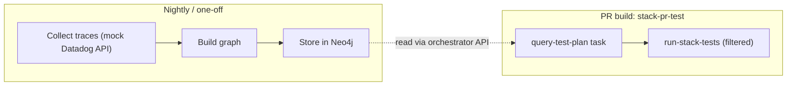

# Milestone 9: Test-trace regression graph and minimal test selection

> **Planned.** Builds on M10 (orchestration service) and M10.1 (Postman testing). Uses traces from nightly regression to build a system test graph, then selects the minimal set of regression tests for a given change. Integrated into the PR pipeline (`stack-pr-test`). Mock Datadog API — no real Datadog account needed.

## Goal

Use traces from nightly regression runs to build a **system test graph** (nodes = services/endpoints, edges = calls observed during tests). Use that graph to:

1. Know which tests (e2e and individual) touch which paths/nodes.
2. Select the **minimal set of regression tests** for a given change.
3. Feed that test list into the PR pipeline so only relevant tests run.

The minimal set **must** include **e2e tests (first priority)** whose path includes the changed node, **plus** **individual/API-level tests** that touch that node. When a change has **no mapped tests**, the system flags the area as needing regression coverage.

**Scope:** Mock API, data generator, CI-facing output. No dependency on a real Datadog account.

---

## What already exists (prerequisites from earlier milestones)

| Capability | Source | How M9 uses it |
|------------|--------|----------------|
| Stack DAG with apps, downstream, propagation roles | `stacks/*.yaml`, M4 | Graph builder extends the static DAG with observed test-to-node edges |
| Orchestration service with REST API and stack resolver | `orchestrator/`, M10 | Graph query endpoint added to the orchestrator; PR pipeline can call it via HTTP |
| Postman/Newman testing pattern | `tests/postman/`, M10.1 | Reuse for testing the mock Datadog API and graph query endpoints |
| Helm chart packaging | `helm/tekton-dag/`, M10 | Neo4j can be added as a subchart or standalone deploy |
| `run-stack-tests` task (two-phase: e2e + per-app) | `tasks/run-stack-tests.yaml` | Extended with `tests-to-run` and `unmapped-area` params |
| PR pipeline with `changed-app` param | `pipeline/stack-pr-pipeline.yaml` | Query task inserted before `run-tests`; receives `changed-app` |
| Dual intercept backends (Telepresence + mirrord) | M7 | No changes; existing intercept flow unchanged |
| Parallel containerize, Kaniko cache | M7.1 | No changes; build flow unchanged |

---

## End-to-end flow

| Stage | What happens | Deliverable |
|-------|--------------|-------------|
| **Collect** | Call mock Datadog REST API to fetch traces from nightly regression. | Mock server or fixtures; graph-builder job. |
| **Store** | Persist the graph and test-to-node mapping in Neo4j. | Neo4j deployment; schema for nodes, edges, test mappings. |
| **Query** | Given `changed-app`, query Neo4j for tests to run. | New endpoint on orchestrator (`GET /api/test-plan?app=X&radius=N`); or standalone query task. |
| **Execute** | PR pipeline runs only the selected tests. | Extended `run-stack-tests` with `tests-to-run` param. |

---

## Integration with the orchestrator and PR pipeline

### Orchestrator extensions

Add to `orchestrator/routes.py`:

- `GET /api/test-plan?app=<changed-app>&radius=<N>` — Query Neo4j for the minimal test set. Returns `{"tests": [...], "unmapped_area": ""}` or `{"tests": [], "unmapped_area": "node-C", "message": "..."}`.
- `POST /api/graph/ingest` — Trigger graph ingestion from mock Datadog traces (nightly job or manual).

Add `orchestrator/graph_client.py` — Neo4j Bolt driver wrapper for Cypher queries.

### PR pipeline changes

In `pipeline/stack-pr-pipeline.yaml`, insert a new task after `deploy-intercepts` and before `run-tests`:

1. **`query-test-plan`** task — calls the orchestrator's `/api/test-plan` endpoint with `changed-app`; outputs `tests-to-run` (comma-separated test IDs) and `unmapped-area` as task results.
2. **`run-stack-tests`** receives `tests-to-run` and `unmapped-area` as optional params. When `tests-to-run` is provided, filter Phase 1/2 to only those tests. When `unmapped-area` is set (and tests-to-run is empty), report "no mapped regression in area X" in the test summary and PR comment.

### Continuation pipeline

`stack-pr-continue-pipeline.yaml` also receives `tests-to-run` / `unmapped-area` for re-runs.

---

## Neo4j deployment

Deploy Neo4j to the Kind cluster (similar to how Postgres is deployed for Tekton Results):

- `scripts/install-neo4j-kind.sh` — deploys Neo4j Community via Helm chart or standalone manifest.
- Neo4j Bolt on port 7687, HTTP on port 7474.
- Orchestrator connects via `neo4j://neo4j:7687` (in-cluster service name).

---

## Mock Datadog API and generated test data

### Mock server

Implement a mock that responds to published Datadog REST API paths (list traces, get trace, search spans) and returns JSON matching the published shape: trace list with spans, resource names, `X-Test-Id` tag, service names. Options:

- **Flask mock service** in `mock-datadog/` — lightweight; deploy alongside the orchestrator.
- **Static fixtures** in `tests/fixtures/datadog/` — JSON files loaded by the graph builder directly.

### Generated data

The mock data must be complex enough to demonstrate realistic test selection:

- Use app/service names from `stacks/stack-one.yaml` (demo-fe, release-lifecycle-demo, demo-api).
- Multiple test types: e2e (full chain), individual/API (single service).
- Multiple tests per node; overlapping paths.
- At least one unmapped area (no tests) for the "needs regression" case.

### Sample inputs and expected outputs

| Input | Expected test plan |
|-------|--------------------|
| Change to `demo-fe` | E2e: fe-smoke, fe-checkout-flow; Individual: fe-unit-api |
| Change to `demo-api` | E2e: fe-smoke (path includes api); Individual: api-crud, api-validation |
| Change to `new-service` (unmapped) | `{"tests": [], "unmapped_area": "new-service", "message": "No mapped regression; area needs tests"}` |

---

## Blast radius and why Neo4j

**Blast radius** = how far from the changed node we look when selecting tests.

- **Radius 1** (default): only tests whose path or touch set includes the changed node.
- **Radius 2+**: also include tests that touch nodes within N hops (callers or callees), catching integration and contract impact.

The query becomes: "from the changed node, expand to depth N along caller/callee edges; return all e2e and individual tests that touch any node in that expanded set." That is a **variable-length traversal** — Cypher expresses this naturally; Postgres would need recursive CTEs.

---

## Test identity tagging

Regression tests must carry a stable **test identity** header (`X-Test-Id`) that propagates through the stack and appears in span metadata. This maps "test T ran, and spans X, Y, Z were observed."

| Framework | How to set |
|-----------|-----------|
| **Postman** | Pre-request script: `pm.request.headers.add({key: 'X-Test-Id', value: pm.info.requestName})` |
| **Playwright** | `page.setExtraHTTPHeaders({'X-Test-Id': test.info().titlePath().join('.')})` |
| **Artillery** | `beforeRequest` hook sets `X-Test-Id` header |

Apps already propagate `x-dev-session` (M4 baggage middleware); add `X-Test-Id` to the same forwarding list.

---

## Deliverables

- [ ] Neo4j deployment script (`scripts/install-neo4j-kind.sh`)
- [ ] Mock Datadog API (Flask mock service or static fixtures)
- [ ] Graph builder that ingests mock traces and populates Neo4j
- [ ] Generated test data matching stack-one apps; includes unmapped area case
- [ ] Orchestrator extensions: `GET /api/test-plan`, `POST /api/graph/ingest`, `graph_client.py`
- [ ] `query-test-plan` Tekton task for the PR pipeline
- [ ] Extended `run-stack-tests` with `tests-to-run` and `unmapped-area` params
- [ ] Pipeline wiring in `stack-pr-pipeline.yaml` and `stack-pr-continue-pipeline.yaml`
- [ ] Postman collection for graph/test-plan endpoints (`tests/postman/graph-tests.json`)
- [ ] Documentation / runbook for running the demo end-to-end

---

## Success criteria

- [ ] A single run can go **collect to store to query to execute** and the chosen tests **actually run** in the PR pipeline.
- [ ] All test cases verified: mapped single node, mapped different node, unmapped area.
- [ ] M9 flow integrated into `stack-pr-test`; same PR run queries the plan and runs only selected tests (or reports unmapped).
- [ ] Existing E2E tests (telepresence + mirrord) still pass with the new query task in the pipeline.
- [ ] Orchestrator test suite updated to cover new graph/test-plan endpoints.

---

## Out of scope

- Real Datadog integration (mock only).
- Real trace instrumentation in apps (mock trace payloads).
- Production-hardening Neo4j (single-node Community edition is sufficient).

---

## References

- [docs/DAG-AND-PROPAGATION.md](../docs/DAG-AND-PROPAGATION.md) — application DAG and propagation
- [stacks/stack-one.yaml](../stacks/stack-one.yaml) — stack and app names
- [pipeline/stack-pr-pipeline.yaml](../pipeline/stack-pr-pipeline.yaml) — PR pipeline (integration target)
- [tasks/run-stack-tests.yaml](../tasks/run-stack-tests.yaml) — test execution task (to be extended)
- [orchestrator/routes.py](../orchestrator/routes.py) — orchestrator endpoints (to be extended)
- [milestones/milestone-10.md](milestone-10.md) — orchestration service (prerequisite)
- [milestones/milestone-10-1.md](milestone-10-1.md) — orchestrator testing pattern (reuse)
- [Datadog API docs](https://docs.datadoghq.com/api/) — trace/list, spans, response schemas for mock
